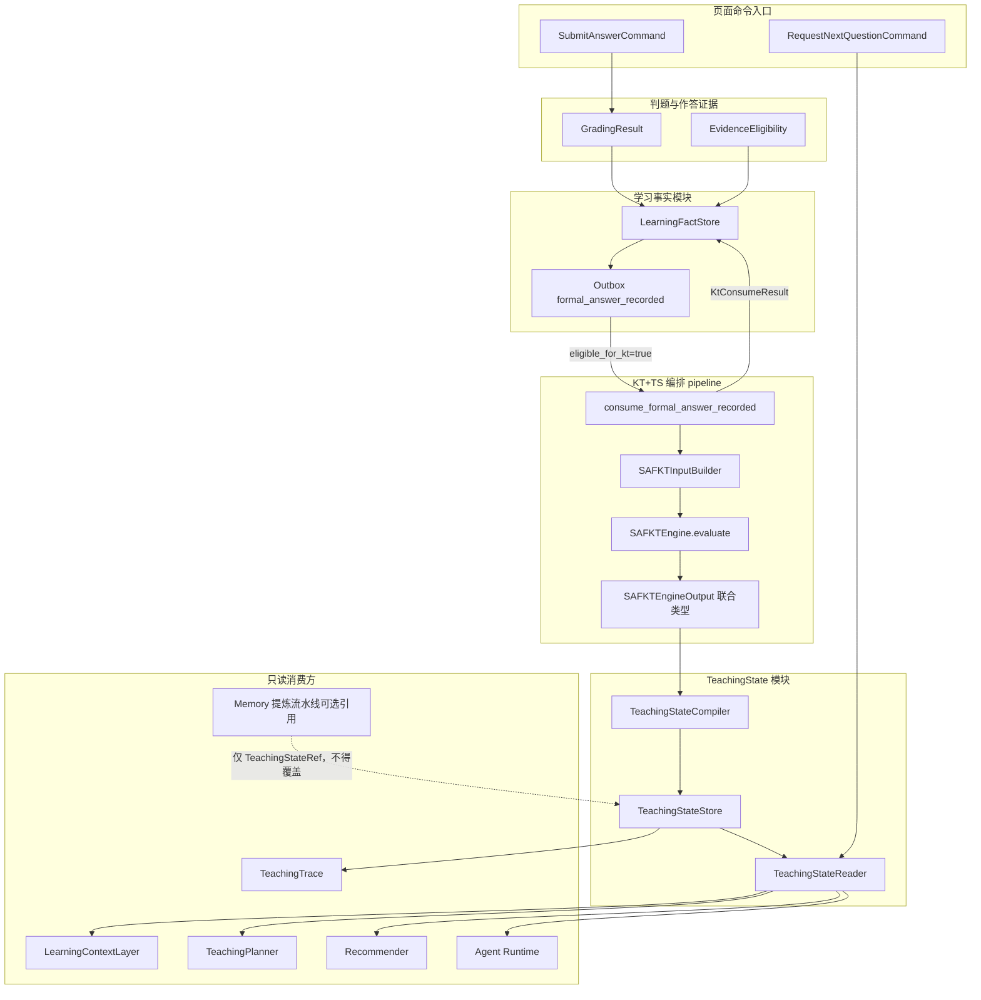
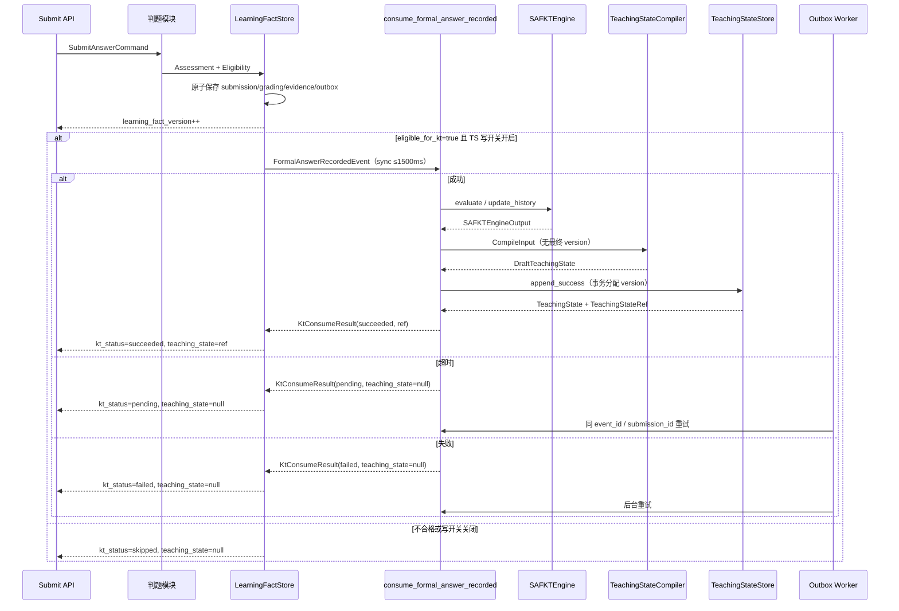
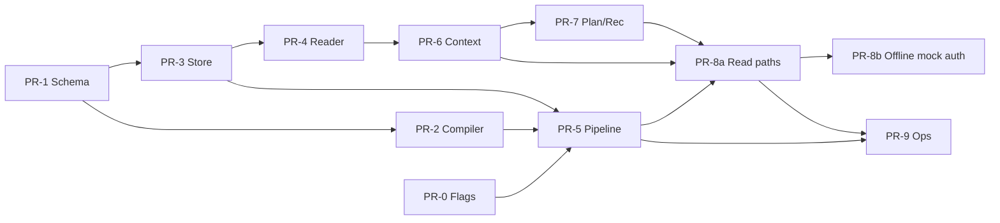

# TeachingState 模块开发设计

> 状态：Draft（评审修订版）  
> 作者：MathTutor Agent 架构组  
> 日期：2026-07-15  
> **Supersedes（取代）**：`设计文档/知识追踪模块开发设计.md` §14 TeachingState 字段与 Compiler 规则（本文为教学状态契约 SSOT）  
> 关联：`重构思考/TeachingState模块.md`、`设计文档/知识追踪模块开发设计.md`（Engine/SAFKT，§13–15 需按本文补丁）、`设计文档/学习事实与题目状态模块开发设计.md`、`设计文档/上下文模块开发设计.md`、`设计文档/判题与作答证据模块开发设计.md`、`设计文档/Agent运行时与工具路由模块开发设计.md`

---

## 1. 文档目的

本文把 **TeachingState** 从知识追踪（KT）设计文档中的附属章节，提升为独立、可落地的模块开发设计。

目标是：

```text
明确 TeachingState 模块与 SAFKT Engine 的职责切分；
给出权威 TeachingState schema、Compiler 算法、存储与版本、只读接口；
与判题、学习事实、Context、Planner、Recommender、Trace、Memory 形成单一契约；
禁止伪造状态、禁止双套字段互相打架。
```

第一版实现贴合当前仓库路径：

```text
backend/app/kt/           # 现有 KT 引擎（mock / dgekt），后续增加 SAFKT + Compiler
backend/app/schemas/      # 现有 learning.py，新增 teaching_state.py
backend/app/context/      # LearningContextLayer 将通过 TeachingStateReader 读取
backend/app/planning/     # TeachingPlanner / Recommender 只读 TeachingState
backend/app/storage/      # SQLite 持久化 TeachingState 快照
```

---

## 2. 一句话定义与问题陈述

### 2.1 一句话定义

```text
TeachingState 模块负责把知识追踪模型输出的学习状态，
整理成本轮教学决策可以直接使用的、带版本与证据门控的结构化状态快照。
```

更口语：

```text
知识追踪模型负责估计“学生会不会”；
TeachingState 模块负责把事实和证据整理成可读取的状态。
```

它是 **SAFKT-V2 引擎** 与 **教学 Agent / Planner / Recommender** 之间的中间层。

### 2.2 问题陈述

学生做题之后，系统不能只知道“答对了”或“答错了”，还需要稳定回答：

```text
学生主要弱在哪个知识点？
为什么系统认为这里有问题？（证据与关键历史）
这个知识点是否需要复习？（遗忘风险估计）
本轮掌握度是模型估计还是真实标签？
证据是否充足？能否用于教学决策？
```

当前代码状态（`backend/app/kt/`、`backend/app/schemas/learning.py`）：

```text
1. KTStateEngine 直接产出 KTDiagnosis / AttributionEvidence，没有独立 TeachingState 快照。
2. ConceptState.mastery 由 mock / DGEKT 启发式更新，缺少 mastery_source=model_estimate 语义。
3. MathTutorLearningLoop 把 progress.version 当作通用版本，没有 kt_state_version / state_id。
4. TeachingPlanner / RiskPrioritizedRecommender 读取 KTDiagnosis 与 KTLearningProgress，契约未统一。
5. LearningContextLayer.authoritative_kt_facts 预留了权威事实槽位，但尚未对接 TeachingStateReader。
6. DGEKT 用 prediction_probability 代理 mastery / forgetting_risk，不符合 SAFKT-V2 + Compiler 分工。
```

TeachingState 模块补齐“编译 + 持久化 + 只读查询”这一层，使上下游只依赖一份权威契约。

---

## 3. Goals / Non-Goals

### 3.1 Goals

```text
G1. 定义唯一权威 TeachingState schema（合并思考文档与 KT §14，禁止两套字段）。
G2. 实现 TeachingStateCompiler：证据门控、weak/forgetting/mistake/key_history 规则、primary_concept 选择。
G3. 持久化 state_id、kt_state_version、幂等键（submission_id / input_fingerprint）。
G4. 提供 TeachingStateStore（写）与 TeachingStateReader（读）稳定接口。
G5. 明确与 KT engine / GradingResult / LearningFact / Context / Planner / Recommender / Trace / Memory 边界。
G6. KT pending/failed、无目标题、evidence insufficient 时不得伪造成功 TeachingState。
G7. 模型原始张量、本机 checkpoint 路径不得进入 LLM 上下文或 Trace 正文。
G8. 与 formal_answer_recorded / eligible_for_kt 契约对齐；Compiler 输入契约以本文为 SSOT。
G9. 写路径在 SAFKT 未就绪时默认关闭，禁止 mock/DGEKT 投影写入正式 TeachingState。
```

### 3.2 Non-Goals

```text
NG1. 不负责 SAFKT-V2 训练、图构建、checkpoint 导出（属 KT 模型工程）。
NG2. 不负责确定性判题、答案归一化、EvidenceEligibility（属判题与作答证据模块）。
NG3. 不负责 formal_answer_recorded 事务与 outbox 落库（属学习事实模块）。
NG4. 不直接生成最终回复、提示深度或推荐路径（属 TeachingPlanner / PracticePathPlanner / Recommender）。
NG5. 不检索 RAG、不写长期记忆、不训练 LLM。
NG6. 第一版不从 attention 自动推断具体错因；不把常见错因当成学生事实。
NG7. 不重新计算掌握度数值；不使用加权正确率替代 model_estimate。
NG8. 不把 DGEKT / mock 输出伪装为正式 SAFKT TeachingState（mock 仅测试注入）。
NG9. 第一版不做概率校准、不确定性网络、完整消融解释。
NG10. 第一版不产生非 unknown 的正式 mistake_type（判题模块尚无错因标签契约）。
```

---

## 4. 系统位置与数据流

### 4.1 系统链路

```text
学生学习事件
  → 判题与作答证据模块（GradingResult / AnswerEvidence / EvidenceEligibility）
  → 学习事实模块（原子保存 + formal_answer_recorded outbox）
  → consume_formal_answer_recorded（本模块 pipeline 对外契约）
      → SAFKTEngine.evaluate（Engine 输出）
      → TeachingStateCompiler.compile
      → TeachingStateStore.append_success（事务内分配 kt_state_version）
  → Context / Planner / Recommender / Trace 只读使用
```

### 4.2 架构图



### 4.3 提交答案时序



### 4.4 与现有 LearningLoop 的演进关系

当前 `MathTutorLearningLoop`（`backend/app/graph/learning_loop.py`）在单次 event 中串行：

```text
load context → diagnose(KT) → assemble → plan → respond → update memory → save progress
```

目标形态拆为两类入口（与 Agent Runtime 设计一致）：

```text
页面提交：判题 → 学习事实 → consume_formal_answer_recorded（不自动回复、不自动推荐）
Agent 聊天：Runtime → Context（含 TeachingStateReader）→ Planner/Generator（只读）
下一题：Recommender 读 TeachingState + 候选题 KT 分数
```

迁移期允许 Loop 内部调用 Reader，但 **权威契约必须是 TeachingState**，不再以 `KTDiagnosis` 作为正式教学状态。

---

## 5. 模块边界

### 5.1 本模块负责

```text
接收 SAFKT Engine 输出、判题事实引用、题目知识点映射摘要。
执行证据门控与结构编译，生成 TeachingState（draft，无最终 version）。
选择 primary_concept_id；整理 weak_concepts / forgetting_signals / key_history。
v1 错因恒为 unknown（结构预留）；后续版本仅证据驱动写入非 unknown。
事务内持久化 TeachingState；Store 原子分配 kt_state_version。
按 submission_id / fingerprint / state_id / student 最新版本提供查询。
对外提供 consume_formal_answer_recorded 编排契约（KtConsumeResult）。
向 Trace 写入 state 引用与版本元数据（不含原始张量）。
对缺失证据 / KT 失败给出明确 status，禁止伪造。
```

### 5.2 本模块不负责

```text
不执行神经网络前向推理（SAFKTEngine）。
不训练或热更新模型参数。
不判定本次 is_correct（GradingResult）。
不计算 eligible_for_kt（EvidenceEligibility）。
不拥有 formal_answer_recorded 事务与 outbox 表（学习事实模块）。
不生成最终回复、提示深度、教学话术。
不选择下一题或修改 current_question。
不检索 RAG，不写 HMS 长期记忆。
不把 attention 权重直接交给 LLM。
不读取或暴露模型原始张量。
不重新统计正式作答 evidence_count（见 §5.3 SSOT）。
```

### 5.3 职责切分：KT Engine vs TeachingState 模块

| 能力 | KT Engine / InputBuilder | TeachingState 模块 |
|---|---|---|
| 历史序列构造 | ✅ SAFKTInputBuilder | ❌ |
| **concept_evidence_count / sufficiency 计算** | ✅ **唯一来源**（基于正式作答历史） | ❌ **禁止重计** |
| 模型推理 | ✅ evaluate → Engine 输出 | ❌ |
| 掌握度数值计算 | ✅ concept_state 输出头 | ❌ **禁止重算** |
| 证据门控（mastery=None） | 提供 count/sufficiency | ✅ 只读透传并 gate |
| weak_concepts 阈值规则 | ❌ | ✅ |
| forgetting 风险档位 | 原始 signal | ✅ 映射 low/medium/high |
| mistake_type | ❌ | ✅ v1 恒 unknown；后续证据驱动 |
| key_history 裁剪与脱敏 | 原始 top-k | ✅ 结构化摘要 |
| 持久化 / **version 原子分配** / 幂等 | ❌ | ✅ Store |
| 对外只读 API | ❌ | ✅ Reader |
| 编排入口 | 被 pipeline 调用 | ✅ `consume_formal_answer_recorded` |

**证据数量/充足度 SSOT（硬规则）：**

```text
concept_evidence_count 与 concept_evidence_sufficiency
唯一由 SAFKTInputBuilder / SAFKTEngine 基于正式作答历史计算并写入 Engine 输出。
Compiler 只读这些字段做门控（不足则 mastery=None），不得按自己的规则重新计数。
若历史与 count 不一致，属 Engine/Builder 缺陷，不得在 Compiler 侧“修数”。
```

> 对 KT 设计 §10.5 的正式修订：原文“Compiler 统计证据数量；判定证据是否充足”改为  
> “**Engine/InputBuilder 统计证据数量并判定充足度；Compiler 只读门控 mastery 与整理结构，不重新计数**”。

```text
KT engine：推理、Engine 输出（含 count/sufficiency）。
TeachingState 模块（Compiler + Store + Reader + pipeline 契约）：
  编译、持久化、版本原子分配、查询、证据门控、错因门控、薄弱点规则、key_history 裁剪。
```

### 5.4 删除测试

```text
若删除 TeachingState 模块，教学/推荐/Agent 将被迫直接读 Engine 输出或 progress 字典，
导致：字段口径分裂、证据门控缺失、版本不可追踪、LLM 可能接触模型内部信号。
```

### 5.5 学生数据删除序列

学习事实模块协调删除（见学习事实 §8）；TeachingState 侧契约：

```text
1. 学习事实模块停止该 student 的 outbox 投递，并取消/标记 pending 消费记录。
2. 调用 TeachingStateStore.delete_student_data(student_id)：
   - 删除 teaching_states 行；
   - 删除 teaching_state_heads 行；
   - 删除 ts_consume_failures（若有）中该 student 记录；
   - 无 heads 时仍返回成功（幂等）。
3. pending 消费游标/outbox 行归属学习事实模块清理，不在 TS Store 内。
4. 允许保留无学生 ID 的聚合运行指标。
```

---

## 6. 权威数据模型

### 6.1 契约原则

```text
1. TeachingState 是教学侧唯一权威快照（SSOT，单一事实来源）。
2. 本文 Supersedes KT 设计 §14 的 TeachingState 字段定义与 Compiler 规则。
3. mastery 一律标 mastery_source = "model_estimate"，不得称为真实标签。
4. 本次正确性权威在 GradingResult；整体掌握权威在 TeachingState。
5. 允许：本次答对 + mastery 低；本次答错 + mastery 高。
6. 持久化只存 SSOT 字段；派生视图不得独立写入。
```

### 6.2 枚举

```python
EvidenceStatus = Literal["complete", "partial", "unavailable"]
EvidenceSufficiency = Literal["insufficient", "limited", "sufficient"]
MasterySource = Literal["model_estimate"]  # 第一版唯一合法值
EngineName = Literal["safkt"]              # 正式运行唯一；mock 不得写入正式库
ForgettingRiskLevel = Literal["low", "medium", "high", "unknown"]
MistakeType = Literal[
    "unknown",
    "concept_misunderstanding",   # 概念理解错误
    "procedure_step_error",       # 解题步骤错误
    "calculation_error",          # 计算错误
    "formula_memory_error",       # 公式或规则记忆错误
    "misread_problem",            # 审题错误
    "transfer_error",             # 知识迁移错误
]
CompileMode = Literal[
    "with_target_prediction",  # 有目标题：含 prediction_probability
    "history_only",            # 无目标题：仅更新历史相关状态，prediction 为空
]
KtConsumeStatus = Literal["succeeded", "pending", "failed", "skipped"]
```

### 6.3 对 KT §14 的正式增补 / 取代表（Supersedes）

| KT §14.2 字段 | 本文处置 | 说明 |
|---|---|---|
| state_id | 不变 | 成功快照 ID |
| student_id / session_id | 不变 | |
| target_question_id | 收紧语义 | with_target 必填；history_only 可空 |
| target_concept_ids | 不变 | |
| engine_name / model_version / mapping_version / compiler_version | 不变 | engine_name 正式仅 safkt |
| prediction_probability | 收紧 | history_only 必须为 None |
| mastery_by_concept | **派生** | SSOT 为 mastery_entries |
| mastery_evidence_count / sufficiency | **派生** | 来自 mastery_entries |
| mastery_source | 不变 | 恒 model_estimate |
| weak_concepts: list[dict] | **收紧为 WeakConcept** | 结构化 |
| forgetting_signals: list[dict] | **收紧为 ForgettingSignal** | 结构化 |
| key_history: list[dict] | **收紧为 KeyHistoryItem** | 结构化；禁止 raw dict 落库 |
| evidence_status / evidence_gaps | 不变（语义见 §7.9） | |
| input_fingerprint / created_at | 不变 | |
| （§14.4 文字）mistake_type | **补全** | 嵌套 `mistake: MistakeEvidence`；v1 恒 unknown |
| — | **新增** kt_state_version | 仅 Store 成功 append 递增 |
| — | **新增** primary_concept_id | 展示与摘要主知识点 |
| — | **新增** mastery_level | primary 的派生展示值 |
| — | **新增** forgetting_risk | 摘要档位 |
| — | **新增** compile_mode | with_target / history_only |
| — | **新增** source_submission_id / source_event_id | 溯源与幂等 |
| — | **新增** grading_result_id | 引用判题，不复制正确性权威 |
| — | **新增** current_question | 题摘要，全文在题库 |

**兼容策略：**

```text
- 其他设计文档凡引用“KT §14 TeachingState”，一律改为引用本文。
- PR-1 同步提交对 知识追踪模块开发设计.md 的补丁说明块（见 §6.5）。
- weak_concepts/forgetting 的 list[dict] 仅允许作为 to_legacy_diagnosis() 投影，不得作为新写入 API。
```

### 6.4 字段语义对照（思考文档 ↔ 权威 schema）

| 思考文档字段 | 权威字段 | 说明 |
|---|---|---|
| student_id | student_id | 一致 |
| session_id | session_id | 一致 |
| current_question | current_question + target_question_id | 摘要 + 规范 ID |
| target_concept_ids | target_concept_ids | 一致 |
| primary_concept_id | primary_concept_id | Compiler 选择规则见 §7 |
| mastery_level | mastery_level（派生） | = primary 的 mastery |
| weak_concepts | weak_concepts | 阈值规则产出 |
| mistake_type | mistake.mistake_type（派生属性） | v1 恒 unknown |
| key_history | key_history | 最多 5 条摘要 |
| forgetting_risk | forgetting_risk + forgetting_signals | 档位 + 明细 |

### 6.5 Engine 输出契约（取代“与 KT §13.2 声称一致”）

**权威声明：**

```text
Compiler 输入契约的 SSOT 在本文（TeachingState 模块设计）。
KT 设计 §13.2 的单一 SAFKTOutput（target_question_id:str 必填、prediction:float 必填）
不足以表达 history_only，故正式拆分为两种 Engine 输出类型。
实现类型定义放在 backend/app/schemas/teaching_state.py（与 TeachingState 同包，避免漂移）。
KT 文档后续必须引用本节，而不是反向强制 TeachingState 退回单一必填 Output。
```

**对 KT §13.2 的正式修订补丁：**

```text
PATCH-KT-13.2：
  删除“唯一 SAFKTOutput 且 target/prediction 必填”作为唯一形态。
  改为：
    SAFKTTargetPredictionOutput  — 有目标题预测
    SAFKTHistoryUpdateOutput     — 仅历史更新 / 无目标题
  联合类型 SAFKTEngineOutput = Target | HistoryUpdate
  evaluate(history, target_question_id) → SAFKTTargetPredictionOutput
  update_after_formal_answer(history) 或 evaluate(..., target=None)
    → SAFKTHistoryUpdateOutput（由 Engine 实现，不在此重复模型结构）
```

```python
class SAFKTKeyHistoryRaw(BaseModel):
    """Engine 输出的关键历史最小字段；禁止原样落入 TeachingState。"""
    question_id: str | None = None
    concept_ids: list[str] = Field(default_factory=list)
    is_correct: bool | None = None
    relative_position: int | None = None
    time_gap_hours: float | None = None
    attention_weight: float | None = None


class SAFKTTargetPredictionOutput(BaseModel):
    """有目标题时的 Engine 输出（取代 KT §13.2 主形态）。"""
    mode: Literal["with_target_prediction"] = "with_target_prediction"
    target_question_id: str  # 必填
    target_concept_ids: list[str]
    prediction_probability: float  # 必填，∈[0,1]
    concept_state_by_concept: dict[str, float]
    concept_evidence_count: dict[str, int]           # SSOT：Engine/Builder
    concept_evidence_sufficiency: dict[
        str, Literal["insufficient", "limited", "sufficient"]
    ]
    retention_by_concept: dict[str, float] = Field(default_factory=dict)
    forgetting_signal_by_concept: dict[str, float] = Field(default_factory=dict)
    key_history: list[SAFKTKeyHistoryRaw] = Field(default_factory=list)
    evidence_status: Literal["complete", "partial", "unavailable"]
    model_version: str
    mapping_version: str
    input_fingerprint: str
    engine_name: Literal["safkt"] = "safkt"


class SAFKTHistoryUpdateOutput(BaseModel):
    """无目标题 / 仅更新历史相关状态时的 Engine 输出。"""
    mode: Literal["history_only"] = "history_only"
    target_question_id: None = None
    target_concept_ids: list[str]  # 本次作答涉及知识点
    prediction_probability: None = None
    concept_state_by_concept: dict[str, float]
    concept_evidence_count: dict[str, int]
    concept_evidence_sufficiency: dict[
        str, Literal["insufficient", "limited", "sufficient"]
    ]
    retention_by_concept: dict[str, float] = Field(default_factory=dict)
    forgetting_signal_by_concept: dict[str, float] = Field(default_factory=dict)
    key_history: list[SAFKTKeyHistoryRaw] = Field(default_factory=list)
    evidence_status: Literal["complete", "partial", "unavailable"]
    model_version: str
    mapping_version: str
    input_fingerprint: str
    engine_name: Literal["safkt"] = "safkt"


SAFKTEngineOutput = SAFKTTargetPredictionOutput | SAFKTHistoryUpdateOutput
# 兼容别名（文档/测试可称 SAFKTOutput 指联合类型，但实现必须区分 mode）
```

Compiler **不得修改** Engine 输出中的掌握度数值与 count；只做门控与结构整理。

### 6.6 TeachingState（权威 schema，SSOT 字段）

```python
from typing import Any, Literal
from pydantic import BaseModel, Field, computed_field, model_validator


class MasteryEntry(BaseModel):
    """单知识点掌握估计（模型估计，非真实标签）。SSOT 单元。"""
    concept_id: str
    concept_name: str | None = None
    mastery: float | None  # None = unknown（证据不足时）
    evidence_count: int = 0
    evidence_sufficiency: Literal["insufficient", "limited", "sufficient"]
    source: Literal["model_estimate"] = "model_estimate"


class WeakConcept(BaseModel):
    concept_id: str
    concept_name: str | None = None
    mastery: float
    evidence_count: int
    reason: str
    confidence: Literal["tentative", "determined"]
    # tentative: 达阈值但 sufficiency=limited
    # determined: sufficiency=sufficient 且 mastery < threshold


class ForgettingSignal(BaseModel):
    concept_id: str
    concept_name: str | None = None
    forgetting_score: float | None
    risk_level: Literal["low", "medium", "high", "unknown"]
    retention: float | None = None
    reason: str | None = None


class KeyHistoryItem(BaseModel):
    """注意力选出的关键历史摘要，不是因果证明。"""
    question_id: str | None = None
    concept_ids: list[str] = Field(default_factory=list)
    is_correct: bool | None = None
    relative_position: int | None = None
    time_gap_hours: float | None = None
    attention_weight: float | None = None
    summary: str
    evidence_status: Literal["partial"] = "partial"


class MistakeEvidence(BaseModel):
    """错因 SSOT。v1 固定 mistake_type=unknown, source=none。"""
    mistake_type: Literal[
        "unknown",
        "concept_misunderstanding",
        "procedure_step_error",
        "calculation_error",
        "formula_memory_error",
        "misread_problem",
        "transfer_error",
    ] = "unknown"
    evidence_refs: list[str] = Field(default_factory=list)
    source: Literal["none", "grading_step", "answer_evidence_rule"] = "none"
    detail: str | None = None
    schema_version: str | None = None  # 未来对接判题 evidence_schema_version


class TeachingStateRef(BaseModel):
    """
    唯一权威轻量引用（提交响应、推荐证据、Trace、学习事实回传）。
    禁止再定义字段不全的第二份 TeachingStateRef。
    """
    state_id: str
    student_id: str
    kt_state_version: int
    evidence_status: Literal["complete", "partial", "unavailable"]
    created_at: str


class TeachingState(BaseModel):
    # —— 身份与版本（kt_state_version 仅由 Store 事务写入后生效）——
    state_id: str
    student_id: str
    session_id: str
    kt_state_version: int  # Store 分配；Compiler draft 可用 0 占位，保存前被覆盖
    compiler_version: str
    engine_name: Literal["safkt"]
    model_version: str
    mapping_version: str
    input_fingerprint: str | None = None

    # —— 本轮题目与知识点 ——
    target_question_id: str | None = None
    current_question: dict[str, Any] | None = None
    # 仅摘要：question_id, concept_ids, stem_summary（≤60 字可选）
    target_concept_ids: list[str] = Field(default_factory=list)
    primary_concept_id: str | None = None

    # —— 模型估计 SSOT ——
    prediction_probability: float | None = None
    mastery_entries: list[MasteryEntry] = Field(default_factory=list)
    mastery_source: Literal["model_estimate"] = "model_estimate"

    # —— 教学整理字段 ——
    weak_concepts: list[WeakConcept] = Field(default_factory=list)
    forgetting_signals: list[ForgettingSignal] = Field(default_factory=list)
    forgetting_risk: Literal["low", "medium", "high", "unknown"] = "unknown"
    key_history: list[KeyHistoryItem] = Field(default_factory=list)
    mistake: MistakeEvidence = Field(default_factory=MistakeEvidence)

    # —— 证据与溯源 ——
    evidence_status: Literal["complete", "partial", "unavailable"]
    evidence_gaps: list[dict[str, Any]] = Field(default_factory=list)
    compile_mode: Literal["with_target_prediction", "history_only"]
    source_submission_id: str | None = None
    source_event_id: str | None = None
    grading_result_id: str | None = None
    # 不存 last_is_correct：防止误用为“刚才对不对”的权威

    created_at: str

    # —— 派生视图（禁止客户端/调用方写入；不单独持久化）——
    @computed_field  # type: ignore[prop-decorator]
    @property
    def mastery_by_concept(self) -> dict[str, float | None]:
        return {e.concept_id: e.mastery for e in self.mastery_entries}

    @computed_field  # type: ignore[prop-decorator]
    @property
    def mastery_evidence_count(self) -> dict[str, int]:
        return {e.concept_id: e.evidence_count for e in self.mastery_entries}

    @computed_field  # type: ignore[prop-decorator]
    @property
    def mastery_evidence_sufficiency(
        self,
    ) -> dict[str, Literal["insufficient", "limited", "sufficient"]]:
        return {e.concept_id: e.evidence_sufficiency for e in self.mastery_entries}

    @computed_field  # type: ignore[prop-decorator]
    @property
    def mastery_level(self) -> float | None:
        if self.primary_concept_id is None:
            return None
        for e in self.mastery_entries:
            if e.concept_id == self.primary_concept_id:
                return e.mastery
        return None

    @computed_field  # type: ignore[prop-decorator]
    @property
    def mistake_type(self) -> str:
        return self.mistake.mistake_type

    @model_validator(mode="after")
    def _ssot_invariants(self) -> "TeachingState":
        if self.engine_name != "safkt":
            raise ValueError("engine_name must be safkt")
        if self.mastery_source != "model_estimate":
            raise ValueError("mastery_source must be model_estimate")
        if self.compile_mode == "history_only" and self.prediction_probability is not None:
            raise ValueError("history_only forbids prediction_probability")
        if (
            self.compile_mode == "with_target_prediction"
            and not self.target_question_id
        ):
            raise ValueError("with_target_prediction requires target_question_id")
        return self

    def to_ref(self) -> TeachingStateRef:
        return TeachingStateRef(
            state_id=self.state_id,
            student_id=self.student_id,
            kt_state_version=self.kt_state_version,
            evidence_status=self.evidence_status,
            created_at=self.created_at,
        )
```

**SSOT 规则（强制）：**

```text
持久化 payload 只序列化 SSOT 字段（mastery_entries、mistake，不含派生 computed_field 的独立列）。
禁止 API 客户端同时提交 mastery_by_concept 与 mastery_entries。
禁止双写 mistake 与顶层 mistake_type 列。
读取方需要 dict 视图时使用 computed_field 或显式 helper，不得缓存第二份权威。
```

### 6.7 CompileInput / CompileResult / Draft

```python
class TeachingStateCompileInput(BaseModel):
    student_id: str
    session_id: str
    engine_output: SAFKTEngineOutput  # 不得为 None；缺输出由 pipeline 直接 failed
    compile_mode: Literal["with_target_prediction", "history_only"]
    # 必须与 engine_output.mode 一致，否则 compile fail

    target_concept_ids: list[str] = Field(default_factory=list)
    declared_primary_concept_id: str | None = None
    # 由 pipeline 从题库/映射只读填充；Compiler 不访问题库

    concept_names: dict[str, str] = Field(default_factory=dict)
    # pipeline 只读 ContentRepository/mapping 填充；缺失则 concept_name=None + gap
    current_question_summary: dict[str, Any] | None = None

    source_submission_id: str | None = None
    source_event_id: str | None = None
    grading_result_id: str | None = None

    # v1 不用于写非 unknown 错因；仅预留类型对接
    answer_evidence: AnswerEvidenceRef | None = None


class AnswerEvidenceRef(BaseModel):
    """v1 仅引用，不解析错因标签。未来对接判题 AnswerEvidence。"""
    evidence_id: str | None = None
    evidence_schema_version: str | None = None
    # v1 无 formal mistake labels；claims 留空
    formal_mistake_labels: list[str] = Field(default_factory=list)


class TeachingStateCompileResult(BaseModel):
    ok: bool
    draft: "DraftTeachingState | None" = None
    # draft 含 state_id（可预生成）但 kt_state_version 占位 0；
    # 最终 version 仅 Store.append_success 分配
    error_code: str | None = None
    error_message: str | None = None
    failure_stage: str | None = None  # teaching_state_compile


class DraftTeachingState(TeachingState):
    """Compiler 产物；kt_state_version 在 Store 提交前视为 provisional。"""
    pass
```

### 6.8 与遗留 schema 的关系

现有 `backend/app/schemas/learning.py`：

```text
ConceptState / KTLearningProgress / KTDiagnosis / AttributionEvidence
```

迁移策略：

```text
1. 新增 backend/app/schemas/teaching_state.py 承载权威模型与 Engine 输出类型。
2. KTDiagnosis 标记为 legacy 兼容视图：可由 TeachingState.to_legacy_diagnosis() 投影。
3. AttributionEvidence.key_history 继续服务专家 Trace；教学决策读 TeachingState.key_history。
4. KTLearningProgress.concept_states 不再作为 mastery 权威。
5. MathTutorState.summary() 的 weak_concepts / forgetting 改为引用最新 TeachingState。
```

---

## 7. Compiler 算法

### 7.1 入口

```python
class TeachingStateCompiler:
    COMPILER_VERSION = "teaching_state_compiler@1.0.0"

    def compile(self, inp: TeachingStateCompileInput) -> TeachingStateCompileResult:
        """纯函数：无 IO、不分配最终 kt_state_version、不写库。"""
        ...
```

配置：

```text
MATHTUTOR_SAFKT_WEAK_THRESHOLD=0.6
MATHTUTOR_TS_WEAK_MIN_EVIDENCE=2
MATHTUTOR_TS_KEY_HISTORY_MAX=5
MATHTUTOR_TS_FORGET_LOW=0.33
MATHTUTOR_TS_FORGET_HIGH=0.66
MATHTUTOR_TS_COMPILER_VERSION=teaching_state_compiler@1.0.0
MATHTUTOR_TS_TENTATIVE_WEAK_SCORE_WEIGHT=0.5
```

### 7.2 总流程

```text
1. 校验 student_id、session_id、compile_mode 与 engine_output.mode 一致
2. 校验 engine_name == safkt；版本字段齐全
3. 校验数值范围：probability / mastery / forgetting ∈ [0,1]
4. 证据门控 → mastery_entries（不足则 mastery=None）；count 只读不重计
5. 选择 primary_concept_id（使用 declared_primary_concept_id）
6. 计算 weak_concepts
7. 映射 forgetting_signals 与摘要 forgetting_risk
8. 裁剪 key_history（≤5，partial；缺键策略见 §7.8）
9. mistake：v1 固定 unknown
10. 汇总 evidence_status / evidence_gaps
11. 生成 state_id；kt_state_version=0（provisional）
12. 返回 DraftTeachingState（Store 再分配真实 version）
```

### 7.3 证据门控（掌握度）

**不变量：**

```text
Compiler 不得使用加权正确率、启发式或“取上一份 mastery”填补缺失。
mastery 数值只能来自 engine_output.concept_state_by_concept。
concept_evidence_count / sufficiency 只读 Engine/Builder SSOT，禁止重计。
没有正式作答证据时，对应知识点 mastery 编译为 unknown（None）。
```

算法：

```text
for concept_id in target_concept_ids ∪ keys(concept_state_by_concept):
    count = concept_evidence_count.get(concept_id, 0)          # 只读
    sufficiency = concept_evidence_sufficiency.get(concept_id) # 只读
    raw = concept_state_by_concept.get(concept_id)

    if count == 0 or sufficiency == "insufficient" or raw is None:
        mastery = None
        if sufficiency is None:
            sufficiency = "insufficient"
        evidence_gaps.append({
            "concept_id": concept_id,
            "gap_type": "insufficient_mastery_evidence",
        })
    else:
        mastery = clamp01(raw)

    mastery_entries.append(MasteryEntry(
        concept_id=...,
        concept_name=concept_names.get(concept_id),  # 可 None
        mastery=mastery,
        evidence_count=count,
        evidence_sufficiency=sufficiency,
        source="model_estimate",
    ))
```

### 7.4 primary_concept_id 选择

```text
规则（按序）：
1. 若 CompileInput.declared_primary_concept_id 非空且在 target_concept_ids 内 → 使用它。
2. 否则在 target_concept_ids 中选 mastery 最低且 mastery is not None 的知识点。
3. 若全部 mastery 为 None，选 target_concept_ids[0]（仅展示，mastery_level 仍为 None）。
4. 若 target_concept_ids 为空 → primary=None，evidence_gaps 记录 missing_target_concepts。
```

`declared_primary_concept_id` 由 **pipeline** 从题库/映射适配器只读填充；Compiler 不访问题库。

多知识点题不得把整题对错写进所有关联知识点的“已证实掌握”标签。

### 7.5 weak_concepts 规则

可配置阈值（默认）：

```text
mastery is not None
mastery < WEAK_THRESHOLD (0.6)
evidence_count >= WEAK_MIN_EVIDENCE (2)
```

```text
if 满足阈值 and sufficiency == "sufficient":
    confidence = "determined"
elif 满足阈值 and sufficiency == "limited":
    confidence = "tentative"
else:
    不进入 weak_concepts
    若 mastery is not None and mastery < threshold and evidence_count < 2:
        evidence_gaps: weak_candidate_insufficient_evidence
```

**禁止：** 仅因本次答错就写入 weak_concepts。

**Recommender 使用（KD17）：** `determined` 全权计入；`tentative` 降权系数默认 0.5（`MATHTUTOR_TS_TENTATIVE_WEAK_SCORE_WEIGHT`）。

### 7.6 forgetting_risk 映射

```text
score = forgetting_signal  # 若仅有 retention，则 score = 1 - retention
if score is None: risk_level = unknown
elif score < FORGET_LOW:  low
elif score < FORGET_HIGH: medium
else: high
```

```text
forgetting_risk =
  在 forgetting_signals 中取 risk_level 最高者（high > medium > low > unknown）
  并列时优先 primary_concept_id
```

文案必须称“遗忘风险估计 / 遗忘信号”，不得称“真实遗忘概率”。

### 7.7 mistake_type 门控（v1 政策）

**v1 硬政策（可测）：**

```text
TeachingState.mistake 恒为：
  mistake_type = "unknown"
  source = "none"
  evidence_refs = []
  detail = None

不调用 map_rule_to_enum。
不读取 AnswerEvidence 步骤文本推断错因。
不从 attention / 低 mastery / RAG mistake_pattern 写错因。
```

**理由：** 判题模块第一阶段 `AnswerEvidence` / `StepEvidence` **不产生正式错因标签**（见判题设计）。在缺少跨模块 schema 时实现“证据驱动非 unknown”必然变成实现者私自发明规则。

**v2 预留（非本版交付）：**

```text
仅当 answer_evidence.formal_mistake_labels 非空
且 evidence_schema_version 在白名单映射表中时：
  按 判题 reason_code / claims[].type → MistakeType 映射表写入。
映射表与判题模块联合版本化；TeachingState 单独不得扩展标签语义。
```

与 `MistakeDiagnoser`（`teaching_planner.py`）关系：

```text
MistakeDiagnoser 混合 RAG mistake_pattern → 仅教学讲解线索，不是学生事实。
不得写回 TeachingState.mistake。
```

### 7.8 key_history 裁剪

输入类型：`list[SAFKTKeyHistoryRaw]`（禁止无结构 `list[dict]` 直接落库）。

```text
最多 KEY_HISTORY_MAX（5）条；
统一 evidence_status = partial；
禁止 attention 描述为因果；禁止答案全文；禁止 attention 矩阵。
```

**缺键策略：**

```text
若 question_id 与 concept_ids 皆空 → skip 该条（记 gap key_history_item_dropped）。
若 is_correct 缺失 → 仍可保留，summary 用“作答结果未知”。
若 attention_weight 缺失 → 填 None，不 drop。
若 relative_position / time_gap 缺失 → 摘要省略该片段。
禁止把 raw model_dump 原样写入 TeachingState.key_history。
```

摘要模板：

```text
“历史题 {question_id}（知识点 {concepts}）答{对|错|结果未知}，相对间隔 {n} 步”
```

### 7.9 evidence_status 汇总

**与 `kt_status` 严格区分：**

| 概念 | 含义 | 谁设置 |
|---|---|---|
| `kt_status` | 本轮管道结果：succeeded/pending/failed/skipped | pipeline / 学习事实响应 |
| `evidence_status` | **已成功保存**快照的证据质量 | Compiler 写入 State |

```text
unavailable（快照质量）：
  engine_output.evidence_status == unavailable
  或关键字段整体缺失导致掌握/薄弱均不可教学依赖
  → 仍可 succeeded 落库，但调用方应降级话术

partial：
  默认常见（key_history partial；存在 limited/insufficient 知识点；history_only）

complete：
  with_target + 所有 target 知识点 sufficiency=sufficient + 无 critical gaps
  （v1 偏保守，少见）
```

**evidence insufficient（知识点级）** 默认滚成 **partial**（个别 concept mastery=None），**不是**自动 `unavailable`。  
仅当 Engine 声明整体 `unavailable` 或 target 全空且无任何可用 mastery 时才为 `unavailable`。

### 7.10 compile_mode 与触发条件

**with_target_prediction**

```text
触发：pipeline 已有明确目标题（例如下一题评分前诊断、或提交后指定 target）。
要求 Target 输出；prediction 必填。
```

**history_only**

```text
触发（v1 唯一正式写路径场景）：
  formal_answer_recorded 消费成功，且本轮不需要对“刚作答的同一题”做目标预测
  （防标签泄漏，与 KT §15.1 一致）。
  即：提交答案后的默认编译模式 = history_only。

不触发：
  会话开始无正式作答；
  闲聊；
  eligible_for_kt=false。

行为：
  prediction_probability = None；
  target_question_id = None；
  更新本次作答涉及知识点的 mastery / forgetting 估计。
```

### 7.11 伪代码

```python
def compile(self, inp: TeachingStateCompileInput) -> TeachingStateCompileResult:
    out = inp.engine_output
    if out.engine_name != "safkt":
        return fail("TS_ENGINE_NOT_SAFKT", stage="teaching_state_compile")
    if out.mode != inp.compile_mode:
        return fail("TS_MODE_MISMATCH", stage="teaching_state_compile")

    mastery_entries, gaps = self._gate_mastery(out, inp)
    primary = self._select_primary(inp, mastery_entries)
    weak = self._weak_concepts(mastery_entries)
    forgetting = self._forgetting(out, inp.concept_names)
    risk = self._summarize_risk(forgetting, primary)
    key_hist = self._trim_key_history(out.key_history)  # SAFKTKeyHistoryRaw → KeyHistoryItem
    mistake = MistakeEvidence()  # v1 恒 unknown
    status, gaps = self._rollup_evidence_status(out, mastery_entries, gaps, inp.compile_mode)

    draft = DraftTeachingState(
        state_id=new_state_id(),
        student_id=inp.student_id,
        session_id=inp.session_id,
        kt_state_version=0,  # provisional；Store 覆盖
        compiler_version=self.COMPILER_VERSION,
        engine_name="safkt",
        model_version=out.model_version,
        mapping_version=out.mapping_version,
        input_fingerprint=out.input_fingerprint,
        target_question_id=getattr(out, "target_question_id", None),
        current_question=inp.current_question_summary,
        target_concept_ids=list(inp.target_concept_ids or out.target_concept_ids),
        primary_concept_id=primary,
        prediction_probability=(
            out.prediction_probability
            if inp.compile_mode == "with_target_prediction"
            else None
        ),
        mastery_entries=mastery_entries,
        mastery_source="model_estimate",
        weak_concepts=weak,
        forgetting_signals=forgetting,
        forgetting_risk=risk,
        key_history=key_hist,
        mistake=mistake,
        evidence_status=status,
        evidence_gaps=gaps,
        compile_mode=inp.compile_mode,
        source_submission_id=inp.source_submission_id,
        source_event_id=inp.source_event_id,
        grading_result_id=inp.grading_result_id,
        created_at=utcnow_iso(),
    )
    return TeachingStateCompileResult(ok=True, draft=draft)
```

---

## 8. 存储与版本

### 8.1 版本字段

| 版本 | 所有者 | 递增条件 |
|---|---|---|
| question_state_version | 学习事实 | 当前题状态变化 |
| learning_fact_version | 学习事实 | 新正式事实 |
| **kt_state_version** | **TeachingState Store** | **仅事务成功 append 新快照时 +1** |
| model_version / mapping_version | KT 产物 | 模型发布 |
| compiler_version | TeachingState 模块 | 编译器发布 |

不变量：

```text
查看答案后的提交：learning_fact_version 递增，kt_state_version 不变。
KT pending/failed：kt_state_version 不变，不写成功 TeachingState。
TeachingState 不得反向修改 GradingResult / AnswerSubmission。
Store 仅 append-only 成功快照；禁止 UPDATE created_at / 原地改 payload 冒充新状态。
```

### 8.2 幂等键（Key Decision，非 Open Question）

| compile_mode | 幂等键 | 索引 |
|---|---|---|
| with_target_prediction | `source_submission_id`（必填） | `UNIQUE(source_submission_id) WHERE source_submission_id IS NOT NULL` |
| history_only | `(student_id, input_fingerprint, compile_mode)` | `UNIQUE(student_id, input_fingerprint, compile_mode)` |

```text
history_only 在提交路径上通常仍带 source_submission_id：
  - 若 submission_id 非空：优先按 submission_id 幂等（与 with_target 相同 partial unique）；
  - 同时仍写入 fingerprint 唯一约束，防止无 submission 的重复管道调用。
  - v1 提交后默认 history_only 且 submission_id 必有（formal_answer_recorded）。
```

幂等行为：

```text
命中已有成功快照：
  返回旧 TeachingState / Ref；
  不递增 kt_state_version；
  不新建 state_id。

pending 中：
  提交响应 teaching_state=null（即使 last_known 存在）；
  kt_status=pending。

failed 后重试成功：
  append 新成功快照，version+1；
  同一 submission_id 仍只有一份成功态（失败记录不在成功表）。
```

### 8.3 kt_state_version 事务协议（Store 原子分配）

**Compiler 不负责最终 version。**

```text
TeachingStateStore.append_success(draft: DraftTeachingState) -> TeachingState:

  BEGIN IMMEDIATE;  -- SQLite：立即写锁，防止并发分配冲突
  1) 幂等检查（submission_id 或 fingerprint 键）
     → 命中则 COMMIT 返回旧行
  2) 校验 draft.engine_name == "safkt"，否则 ROLLBACK + TS_ENGINE_NOT_SAFKT
  3) SELECT kt_state_version FROM teaching_state_heads WHERE student_id=?
     next_version = COALESCE(head, 0) + 1
  4) INSERT teaching_states (... kt_state_version=next_version, payload ...)
  5) UPSERT teaching_state_heads (student_id, state_id, kt_state_version, updated_at)
  6) COMMIT
  7) 返回完整 TeachingState（version 已固化）

并发两个不同 submission：
  串行化在 BEGIN IMMEDIATE；后者读到更新后的 head。

唯一约束冲突（极端）：
  返回 TS_VERSION_CONFLICT，pipeline 可重试 append 一次；
  不得吞掉错误并返回旧 head 冒充本轮成功。
```

### 8.4 存储模型（SQLite 第一阶段）

```sql
CREATE TABLE teaching_states (
  state_id             TEXT PRIMARY KEY,
  student_id           TEXT NOT NULL,
  session_id           TEXT NOT NULL,
  kt_state_version     INTEGER NOT NULL,
  source_submission_id TEXT,
  source_event_id      TEXT,
  engine_name          TEXT NOT NULL CHECK (engine_name = 'safkt'),
  model_version        TEXT NOT NULL,
  mapping_version      TEXT NOT NULL,
  compiler_version     TEXT NOT NULL,
  input_fingerprint    TEXT NOT NULL,
  evidence_status      TEXT NOT NULL,
  compile_mode         TEXT NOT NULL,
  payload_json         TEXT NOT NULL,
  created_at           TEXT NOT NULL,
  UNIQUE (student_id, kt_state_version)
);

-- with_target / 带 submission 的 history_only
CREATE UNIQUE INDEX uq_ts_submission
  ON teaching_states(source_submission_id)
  WHERE source_submission_id IS NOT NULL;

-- history_only 与调试重放：fingerprint 幂等
CREATE UNIQUE INDEX uq_ts_fingerprint_mode
  ON teaching_states(student_id, input_fingerprint, compile_mode);

CREATE TABLE teaching_state_heads (
  student_id       TEXT PRIMARY KEY,
  state_id         TEXT NOT NULL,
  kt_state_version INTEGER NOT NULL,
  updated_at       TEXT NOT NULL
);

-- 可选：失败审计（不参与 get_latest）
CREATE TABLE teaching_state_consume_failures (
  id               TEXT PRIMARY KEY,
  student_id       TEXT NOT NULL,
  submission_id    TEXT,
  event_id         TEXT,
  failure_stage    TEXT NOT NULL,
  error_code       TEXT,
  created_at       TEXT NOT NULL
);
```

**Append-only：** 成功表无 UPDATE payload/created_at 的业务路径；更正只能新增 version。

### 8.5 Store 接口

```python
class TeachingStateStore(Protocol):
    def append_success(self, draft: DraftTeachingState) -> TeachingState:
        """事务：幂等 + 分配 kt_state_version + 更新 head。"""

    def get_by_id(self, state_id: str) -> TeachingState | None: ...

    def get_latest(self, student_id: str) -> TeachingState | None: ...

    def get_by_version(
        self, student_id: str, kt_state_version: int
    ) -> TeachingState | None: ...

    def get_by_submission(self, submission_id: str) -> TeachingState | None: ...

    def record_failure(
        self,
        *,
        student_id: str,
        submission_id: str | None,
        event_id: str | None,
        failure_stage: str,
        error_code: str | None,
    ) -> None: ...

    def delete_student_data(self, student_id: str) -> None:
        """幂等删除成功快照、head、该生 failure 行。"""
```

### 8.6 提交 API 返回约定（与学习事实对齐）

```text
kt_status=succeeded → teaching_state = TeachingStateRef（完整五字段）
kt_status=pending   → teaching_state = null（禁止填 last_known 冒充本轮）
kt_status=failed    → teaching_state = null，failure_stage，retryable=true
kt_status=skipped   → teaching_state = null，skip_reason
```

同步等待上限：`MATHTUTOR_KT_SUBMISSION_TIMEOUT_MS=1500`。

---

## 9. 读取接口与调用方约定

### 9.1 TeachingStateReader

```python
class TeachingStateReader(Protocol):
    def get_latest(self, student_id: str) -> TeachingState | None:
        """无状态返回 None，不伪造默认 mastery。始终返回库中对象（含 evidence_status）。"""

    def get(self, state_id: str) -> TeachingState | None: ...

    def get_ref_latest(self, student_id: str) -> TeachingStateRef | None: ...

    def require_latest_for_teaching(
        self, student_id: str, *, min_status: EvidenceStatus | None = None
    ) -> TeachingState | TeachingStateUnavailable:
        """
        精确条件：
        - 无 head → not_found
        - 有 State 且 evidence_status=unavailable 且调用方要求可用证据
          → 返回 TeachingStateUnavailable(reason=evidence_unavailable, last_known_state_id=...)
          默认 min_status=None 时仍返回 State，由调用方读 evidence_status 自行降级
        - kt_pending / kt_failed 不是 Reader 状态：由 pipeline/提交响应表达，
          Reader 不把 pending 伪装进 get_latest
        """
```

```python
class TeachingStateUnavailable(BaseModel):
    reason: Literal[
        "not_found",
        "evidence_unavailable",
    ]
    message: str
    last_known_state_id: str | None = None
    # last_known 仅审计；禁止当作本轮 succeeded 的 teaching_state 返回
```

**Context 组装：** `authoritative_kt_facts` 使用 `to_llm_facts` 或白名单字段；**剥离**任何可能混淆判题权威的字段；不把完整 `model_dump()` 无过滤塞给 LLM。

### 9.2 调用方约定

| 调用方 | 如何读 | 禁止 |
|---|---|---|
| LearningContextLayer | Reader → authoritative_kt_facts | 改写 mastery；硬预算（hard budget）不足时仍保留 KT 核心 |
| TeachingPlanner | weak / forgetting / mistake / mastery_level | 写回 Store；RAG 错因写入 State |
| Recommender | 按 §10.4 适配表 | 推荐失败回写状态 |
| Agent Runtime | 经 Context 间接读 | 聊天更新 TeachingState |
| TeachingTrace | state_id + 版本 | 张量与本机路径 |
| Memory | 可选异步引用 TeachingStateRef | 覆盖 State 内容 |
| SAFKTEngine | 不读 State 作标签 | — |

### 9.3 Runtime 意图与是否读取

```text
small_talk              → 不读 TeachingState
concept_question        → 一般不读
current_question_help   → 按需读
mistake_explanation     → 读最新 TeachingState + GradingResult（对错只认 Grading）
next_step_advice        → 读最新 TeachingState
recommendation_reason   → 读推荐时保存的 TeachingStateRef
review_summary          → 读最新 TeachingState
```

### 9.4 对 LLM 暴露的安全投影

```python
def to_llm_facts(state: TeachingState) -> dict:
    return {
        "state_id": state.state_id,
        "kt_state_version": state.kt_state_version,
        "primary_concept_id": state.primary_concept_id,
        "mastery_level": state.mastery_level,
        "mastery_source": "model_estimate",
        "weak_concepts": [w.model_dump() for w in state.weak_concepts],
        "forgetting_risk": state.forgetting_risk,
        "forgetting_signals": [f.model_dump() for f in state.forgetting_signals],
        "mistake_type": state.mistake_type,  # v1 恒 unknown
        "key_history_summaries": [k.summary for k in state.key_history],
        "prediction_probability": state.prediction_probability,
        "evidence_status": state.evidence_status,
        "evidence_gaps": state.evidence_gaps,
        # 不含 grading 正确性、不含完整 current_question 长文本
    }
```

---

## 10. 与上下游模块的关系

### 10.1 总表

| 模块 | 关系 | 数据方向 |
|---|---|---|
| 判题与作答证据 | grading_result_id 引用；v1 不吸收错因标签 | → 引用 |
| 学习事实 | 调 `consume_formal_answer_recorded`；收 `KtConsumeResult` | 编排双向，权威不覆盖 |
| SAFKT Engine | Engine 输出类型 | → Compiler |
| Context | TeachingStateReader | → AssembledContext |
| TeachingPlanner | 只读 | |
| Recommender | 只读 + §10.4 适配 | |
| Agent Runtime | 只读 | |
| TeachingTrace | 引用 | |
| Memory / HMS | 记忆提炼流水线可异步写入 TeachingStateRef 到记忆原料；由记忆模块负责，不在本模块写 HMS | 禁止覆盖 State |
| RAG | 无关写路径 | |

### 10.2 GradingResult vs TeachingState

```text
GradingResult：这一次提交答对了吗？
TeachingState：相关知识点整体掌握得怎么样？
```

```text
回复“刚才答对了吗” → 只读 GradingResult（禁止用 TeachingState 推断）
回复“这个知识点掌握得怎么样” → 只读 TeachingState
```

TeachingState **不冗余 last_is_correct**，避免误用。

### 10.3 编排契约：`consume_formal_answer_recorded`

学习事实模块 **只依赖** 本接口，不直接调 Compiler/Store 细节。

```python
class FormalAnswerRecordedEvent(BaseModel):
    event_id: str
    submission_id: str
    student_id: str
    session_id: str
    question_id: str
    is_correct: bool
    graded_at: str
    eligible_for_kt: Literal[True]
    grading_result_id: str
    concept_ids: list[str] = Field(default_factory=list)
    # 其他历史构造所需引用由 pipeline 经 LearningFactReader 拉取


class KtConsumeResult(BaseModel):
    status: Literal["succeeded", "pending", "failed", "skipped"]
    teaching_state: TeachingStateRef | None  # 仅 succeeded 非 null
    failure_stage: str | None = None
    # safkt_inference | teaching_state_compile | teaching_state_save | timeout
    error_code: str | None = None
    error_message: str | None = None
    retryable: bool = False
    skip_reason: str | None = None
    duration_ms: int | None = None


class TeachingStatePipeline(Protocol):
    def consume_formal_answer_recorded(
        self, event: FormalAnswerRecordedEvent
    ) -> KtConsumeResult:
        """
        同步路径：学习事实在 DB commit 后调用，预算 ≤1500ms。
        超时：立即返回 pending；不得返回旧 Ref 作为 teaching_state。
        """
        ...
```

**管道步骤：**

```text
1. 若 MATHTUTOR_TS_WRITE_ENABLED=false → skipped（skip_reason=ts_write_disabled）
2. 若 engine 非 safkt 或 SAFKT 未就绪 → failed/skipped（不写伪造 State）
3. 幂等：submission 已有成功 State → succeeded + 旧 Ref
4. 构造历史（InputBuilder）→ Engine history_only 输出（提交默认）
5. pipeline 只读题库填充 concept_names / declared_primary / current_question_summary
   - 名称缺失 → gap，不伪造名称，不 fail（除非 mapping 致命错误）
6. Compiler.compile → draft
7. Store.append_success → State + Ref
8. Trace 最小字段
9. 返回 KtConsumeResult(succeeded, ref)
```

**超时与半完成：**

```text
- 1500ms 由学习事实侧计时；超时返回 pending，retryable=true。
- 若 evaluate 已完成但尚未 append：允许 outbox 重试；append 幂等键保证不双写。
- v1 不强制取消正在跑的 PyTorch 前向；后台重试时靠幂等与“同 submission 只成功一次”。
- 超时响应 teaching_state 必须为 null。
```

**Outbox：** 学习事实拥有 outbox 表；worker 再次调用同一 `consume_formal_answer_recorded`。

### 10.4 推荐与下一题：TeachingState → scorer 适配表

当前 `RiskPrioritizedRecommender`（`backend/app/planning/recommender.py`）字段迁移：

| 旧特征 | 来源 | 新来源 | 适配规则 |
|---|---|---|---|
| weak_concept_match | `diagnosis.weak_concepts[].concept_id` | `state.weak_concepts` | determined：权重 1.0；tentative：权重 `TENTATIVE_WEAK_SCORE_WEIGHT`（默认 0.5）；不在 weak 列表：沿用旧默认 0.45/0.65 逻辑 |
| forgetting_urgency | `diagnosis.forgetting_risks[].forgetting_risk` **float** | `forgetting_signals` + 摘要档位 | 映射：low→0.2，medium→0.5，high→0.85，unknown→0.0；取题目 concept 对应 signal，缺省 0.0 |
| difficulty_fit / mastery | `progress.concept_states[].mastery` | `mastery_by_concept`（派生） | mastery is None → 视为 **中性 0.5** 仅用于难度锚点，并标记 `mastery_unknown=true`（不得当 0 狠压难度） |
| prediction_risk | `diagnosis.prediction_probability` 单值 | **CandidateKTScorer** 对候选题的目标概率（Engine） | 不在 TeachingState 单字段；无评分时该因子=中性 0.5 且记 gap |
| forgetting on progress | `concept_states.forgetting_risk` float | 同上档位映射 | 不用 progress 权威 |

```text
无 TeachingState：
  teaching_state_missing=true；
  保守默认题库策略（或拒绝个性化薄弱点选题）；
  不得用 mock diagnosis 冒充。
```

### 10.5 与思考文档四优化点对应

| 模型侧优化 | TeachingState 处理 |
|---|---|
| 知识点掌握度输出头 | 透传 + 证据门控；不重算 |
| 错误类型判断 | **v1 恒 unknown**；结构预留 |
| 注意力 → 关键历史 | ≤5 条摘要 partial |
| 遗忘风险显式输出 | low/medium/high 估计 |

### 10.6 pipeline 对题库的只读适配

```text
pipeline 可只读 ContentRepository / mapping 以填充：
  concept_names、declared_primary_concept_id、current_question_summary。
失败策略：
  非致命：concept_name=None，evidence_gaps += missing_concept_name；
  致命映射错误：KtConsumeResult failed，failure_stage 合适阶段，不写伪造 State。
Compiler 本身不依赖题库 IO（纯函数可测）。
```

---

## 11. 错误与降级策略（禁止伪造）

### 11.1 总原则

```text
不创建 mock TeachingState 进入正式库。
不使用上一份状态改 created_at 冒充本轮新状态（append-only）。
不使用启发式概率冒充 SAFKT 输出。
不在 KT 失败时生成成功 TeachingState。
不把 DGEKT/mock 投影写入 engine_name=safkt。
pending 响应 teaching_state 必须为 null。
MATHTUTOR_TS_WRITE_ENABLED=false 时整条写路径 skipped。
```

### 11.2 场景矩阵

| 场景 | 行为 | kt_status | teaching_state |
|---|---|---|---|
| write disabled | 不调用 Engine/Compiler | skipped | null |
| eligible_for_kt=false | 不调用 | skipped | null |
| KT 推理超时 | 不写成功 State | pending | **null** |
| KT 推理失败 | record_failure | failed | null |
| Compiler 失败 | record_failure | failed | null |
| Store 拒绝 non-safkt | record_failure | failed | null |
| 映射致命失败 | 拒绝 | failed | null |
| 提交后默认 history_only 成功 | append | succeeded | Ref |
| 知识点 evidence insufficient | 成功但 partial | succeeded | Ref（mastery 可 None） |
| Engine 整体 unavailable | 成功落库 quality=unavailable | succeeded | Ref |
| 重复 submission | 幂等返回旧 | succeeded | 旧 Ref |
| SAFKT 未就绪 | 不写 | failed/skipped | null |
| Reader 无数据 | — | — | not_found |

### 11.3 调用方降级

```text
Planner / Agent：说明状态暂不可用/证据不足；可用 GradingResult 讲当次对错；不编造薄弱点。
Recommender：teaching_state_missing 保守策略。
```

### 11.4 错误码

```text
TS_KT_OUTPUT_MISSING
TS_ENGINE_NOT_SAFKT
TS_MODE_MISMATCH
TS_INVALID_PROBABILITY
TS_VERSION_MISSING
TS_VERSION_CONFLICT
TS_IDEMPOTENT_HIT
TS_COMPILE_REJECTED
TS_NOT_FOUND
TS_EVIDENCE_UNAVAILABLE
TS_WRITE_DISABLED
```

---

## 12. 建议目录与代码落点

```text
backend/app/schemas/
  teaching_state.py          # Engine 输出联合类型、TeachingState、Ref、契约 DTO
  learning.py                # legacy

backend/app/kt/
  engine.py                  # 现有 Protocol（迁移期）
  safkt_engine.py            # 新增（KT 阶段四）
  teaching_state.py          # Compiler
  teaching_state_store.py    # Store + 事务 version
  teaching_state_reader.py   # Reader
  pipeline.py                # consume_formal_answer_recorded
  factory.py                 # 正式 safkt；测试注入须标 test_only

backend/app/context/
  learning_context.py
  readers/teaching_state.py  # 可选适配器（Adapter）

backend/app/planning/
  teaching_planner.py
  recommender.py

tests/
  test_teaching_state_compiler.py
  test_teaching_state_store_idempotency.py
  test_teaching_state_store_rejects_non_safkt.py
  test_teaching_state_reader.py
  test_no_forged_state_on_kt_failure.py   # PR-5 必过
  test_consume_formal_answer_recorded.py
```

---

## 13. 观测性与 Readiness（就绪检查）

### 13.1 最小实现（V1）

```text
不强制新建 Prometheus 栈。
优先结构化日志字段（与 provider_health / readiness 风格一致）：
  ts_event=compile|save|consume
  result, failure_stage, evidence_status, kt_state_version,
  duration_ms, engine_name, compile_mode

可选计数器（进程内或现有 metrics 钩子）：
  teaching_state_compile_total{result}
  teaching_state_save_idempotent_hit_total
```

### 13.2 与 readiness / provider_health 关系

```text
SAFKT 产物/依赖失败 → readiness 中 KT 探针失败（既有 KT 设计）。
MATHTUTOR_TS_WRITE_ENABLED=false：
  - 提交答案 API 仍应成功（判题与事实保存）；
  - kt_status=skipped；
  - readiness 可绿（写关闭是配置态，不是故障），但探针应暴露 ts_write_enabled=false。
MATHTUTOR_TS_WRITE_ENABLED=true 且 SAFKT 不可用：
  - 需要 KT 的正式消费返回 failed/pending；
  - readiness 对“KT/TS 写路径”标记 degraded/fail（与 KT readiness 绑定）。
TeachingState Reader 缺失数据不是 readiness 红灯（学生尚未作答）。
```

### 13.3 Trace 字段

```text
state_id, engine_name=safkt, model_version, mapping_version, compiler_version,
kt_state_version, target_question_id, target_concept_ids, primary_concept_id,
prediction_probability, evidence_status, input_fingerprint, mistake_type, failure_stage
```

禁止：本机 checkpoint 路径、原始张量、完整答案原文、未脱敏配置。

### 13.4 告警建议

```text
consume 错误率突增；pending 积压；evidence_unavailable 比例异常；幂等命中异常偏高。
```

---

## 14. 安全与隐私

```text
TeachingState 属个人学习数据。
删除：§5.5 序列 + Store 幂等 delete。
LLM：to_llm_facts。
key_history / input_fingerprint 不含答案全文。
```

| 威胁 | 严重度 | 缓解 |
|---|---|---|
| LLM 改写 mastery | 高 | 只读 Reader；写路径仅 pipeline |
| 旧 State 冒充新 State | 高 | append-only；pending 返回 null |
| attention 当因果错因 | 中 | partial + v1 mistake unknown |
| mock 入生产 | 高 | Store CHECK engine_name；write 开关；factory |
| 误用 State 回答对错 | 中 | 不存 last_is_correct；Context 剥离 |

---

## 15. 测试计划

### 15.1 Compiler

```text
[ ] 透传 model mastery，不重算、不重计 evidence_count
[ ] evidence_count=0 → mastery=None
[ ] weak 阈值与 tentative/determined
[ ] v1 mistake 恒 unknown
[ ] key_history ≤5 partial；缺键 skip/partial 策略
[ ] forgetting 分档边界
[ ] primary：declared_primary 优先
[ ] history_only → prediction is None
[ ] mode mismatch → fail
[ ] engine_name != safkt → fail
[ ] mastery_source 恒 model_estimate
```

### 15.2 Store / 幂等 / 并发

```text
[ ] 同 submission_id 两次 append → 同一 state_id / version
[ ] history_only 同 fingerprint 幂等
[ ] 成功 append → version 原子 +1；并发两 submission 不撞号
[ ] 拒绝 engine_name != safkt
[ ] 无 UPDATE created_at 路径（仅 insert）
[ ] delete_student_data 幂等（无 head 也成功）
```

### 15.3 Pipeline / 禁伪造

```text
[ ] test_no_forged_state_on_kt_failure（PR-5 必过）
[ ] pending 响应 teaching_state is null（即使存在 last_known）
[ ] write_disabled → skipped
[ ] FakeSAFKTOutput 仅 test_only 且 engine_name=safkt；禁止 dgekt 投影入库
[ ] 超时半完成重试不双写
```

### 15.4 集成

```text
[ ] formal_answer_recorded → Ref
[ ] Context authoritative_kt_facts 来自 Reader
[ ] Planner/Recommender 按适配表；None mastery → 0.5 中性
[ ] mistake_explanation 对错读 Grading
```

### 15.5 验收不变量

```text
[ ] 正式 TeachingState.engine_name 仅为 safkt
[ ] Store 拒绝非 safkt
[ ] 无证据 mastery unknown
[ ] 注意力 partial
[ ] v1 错因 unknown
[ ] 失败不伪造；pending 不返回旧 Ref 作本轮 teaching_state
[ ] append-only
[ ] Grading 与 TeachingState 权威分离
[ ] Trace 无张量/本机路径
```

---

## 16. 配置

```text
MATHTUTOR_TS_WRITE_ENABLED=false          # 默认关；SAFKT 就绪后显式打开
MATHTUTOR_TS_READ_AUTHORITATIVE=false     # Context/Planner 切换开关
MATHTUTOR_TS_COMPILER_VERSION=teaching_state_compiler@1.0.0
MATHTUTOR_SAFKT_WEAK_THRESHOLD=0.6
MATHTUTOR_TS_WEAK_MIN_EVIDENCE=2
MATHTUTOR_TS_KEY_HISTORY_MAX=5
MATHTUTOR_TS_FORGET_LOW=0.33
MATHTUTOR_TS_FORGET_HIGH=0.66
MATHTUTOR_TS_TENTATIVE_WEAK_SCORE_WEIGHT=0.5
MATHTUTOR_KT_SUBMISSION_TIMEOUT_MS=1500
MATHTUTOR_KT_ENGINE=safkt                 # 正式目标；当前代码仍为 mock|dgekt，见 PR-0
MATHTUTOR_SAFKT_ARTIFACT_DIR=...
```

不提供：

```text
MATHTUTOR_TS_ALLOW_FORGE
MATHTUTOR_TS_FALLBACK_HEURISTIC_MASTERY
MATHTUTOR_KT_FALLBACK_ENGINE
MATHTUTOR_KT_ALLOW_MOCK          # 正式环境
MATHTUTOR_TS_ALLOW_DGEKT_PROJECT # 禁止 DGEKT→TeachingState 投影入库
```

---

## 17. Key Decisions

| # | 决策 | 理由 |
|---|---|---|
| KD1 | TeachingState = Compiler + Store + Reader + pipeline 契约 | 版本/幂等/禁伪造需要稳定边界 |
| KD2 | 掌握度只来自 SAFKT 输出头；Compiler 禁止重算 | 防止正确率冒充 mastery |
| KD3 | mastery_source 固定 model_estimate | 无真值标签 |
| KD4 | 本文 Supersedes KT §14；字段级 diff 见 §6.3 | 消除双契约 |
| KD5 | **v1 mistake 恒 unknown**；结构预留 v2 | 判题尚无正式错因标签 |
| KD6 | key_history ≤5，partial；输入类型 SAFKTKeyHistoryRaw | 注意力非因果 |
| KD7 | weak 阈值 + min evidence | 低证据不标确定薄弱 |
| KD8 | forgetting 档位估计 | 可教学使用且不伪概率 |
| KD9 | **kt_state_version 仅 Store 事务分配** | 并发安全；Compiler 纯函数 |
| KD10 | **幂等：submission partial unique + (student, fingerprint, mode)** | history_only 可编码 |
| KD11 | 正式 engine_name 仅 safkt；Store 拒绝其他 | 可审计 |
| KD12 | GradingResult ≠ TeachingState 问题域 | 允许表面“矛盾” |
| KD13 | 教学侧只读 Reader | 权威可追溯 |
| KD14 | legacy Diagnosis 仅投影 | 降低一次性破坏 |
| KD15 | 提交后默认 history_only | 防泄漏；与 KT §15.1 一致 |
| KD16 | **Engine 输出拆 Target / HistoryUpdate；Compiler 输入 SSOT 在本文** | 解决 §13.2 必填冲突 |
| KD17 | **evidence_count SSOT 在 Engine/Builder** | 禁止 Compiler 双计 |
| KD18 | **SSOT 持久化 mastery_entries + mistake；派生 computed_field** | 禁双写分叉 |
| KD19 | **唯一 TeachingStateRef 五字段** | 禁第二定义 |
| KD20 | **tentative weak 降权 0.5** | Recommender 可落地 |
| KD21 | **不存 last_is_correct** | 防误用权威 |
| KD22 | **写开关默认关；无 SAFKT 禁止投影入库** | 防中间 PR 污染 |
| KD23 | **learning 只调 consume_formal_answer_recorded** | 编排契约清晰 |
| KD24 | **history_only 触发=提交后默认编译** | 测试与实现有边界 |

---

## 18. Alternatives Considered

### 方案 A：继续用 KTDiagnosis / KTLearningProgress

```text
优点：改动小。缺点：无 version/证据门控。结论：否决为正式方案。
```

### 方案 B：Engine 内直接返回 TeachingState

```text
优点：链路短。缺点：耦合持久化与教学契约。结论：否决。
```

### 方案 C：TeachingState 含 hint_depth / next_path

```text
优点：下游省事。缺点：越界 Planner。结论：否决。
```

### 方案 D：失败时回退上一 State 改时间

```text
优点：UI 有数。缺点：伪造本轮更新。结论：否决。
```

### 方案 E（采纳）：Compiler + Store + Reader + 编排契约

```text
结论：采纳。
```

### 方案 F：仅投影层、不落库（过渡）

```text
优点：可先验证 Compiler 与 Context 组装。
缺点：无 kt_state_version、无提交 Ref、无幂等、跨进程不可恢复。
结论：允许作为 **阶段 0 / PR-2 单元验证**（纯编译，内存中 draft），
**不算正式 TeachingState 权威来源**；正式权威从 Store append 成功开始。
不得用“内存投影”应答 kt_status=succeeded。
```

---

## 19. 风险

| 风险 | 严重度 | 缓解 |
|---|---|---|
| 与旧 KT §14 文档漂移 | 高 | Supersedes 表 + PR-1 改 KT 文档指针 |
| 双写 Diagnosis + State | 高 | 单一 compile 出口；开关分阶段 |
| DGEKT 投影入库 | 高 | 写开关 + Store CHECK + 禁配置项 |
| primary 不符合教研直觉 | 中 | declared_primary 可配置 |
| weak 阈值失准 | 中 | 配置 + 日志 |
| SAFKT 长期未就绪阻塞 | 中 | 写关闭仍可交付只读/编译；PR-8 拆阶段 |

---

## 20. Open Questions

```text
Q1. （已关闭 → KD10/KD24）history_only 幂等与触发条件。
Q2. current_question.stem_summary 上限 60 字是否需按终端类型配置？倾向固定 60。
Q3. （已关闭 → KD20）tentative weak 降权系数。
Q4. progress_store / KTLearningProgress.version 下线时间表？待 SAFKT 阶段四后迁移 PR。
Q5. v2 错因映射表与判题 evidence_schema_version 的联合发布节奏？待判题模块表结构落地。
Q6. with_target 编译是否在“下一题评分”路径也写 TeachingState，还是仅缓存候选分？
    倾向：候选评分不写全局 TeachingState，只写推荐证据中的 per-candidate 分数。
```

---

## 21. Rollout Plan

```text
阶段 0：Schema + Compiler 纯函数（无写库）= 方案 F 验证
阶段 0.5：配置扩展 + TS_WRITE_ENABLED 默认 false
阶段 1：Store + 事务 version + 幂等 + 拒非 safkt
阶段 2：pipeline 契约 + Fake safkt 输出测通（test_only）；正式写仍关
阶段 3：SAFKT 就绪后打开 WRITE；提交路径 history_only
阶段 4：READ_AUTHORITATIVE；Context 切换
阶段 5：Planner/Recommender 适配表
阶段 6：只读切换完成；下线 mock 权威（依赖 KT 阶段四）
回滚：关 WRITE / READ 开关；不得开启 forge
```

---

## 22. 示例

学生答错一元一次方程题后（history_only 成功）：

```text
compile_mode: history_only
prediction_probability: null
mastery_entries: [{ concept: 移项, mastery: 0.42, sufficiency: sufficient, count: 3 }]
primary_concept_id: 移项
mastery_level: 0.42（派生）
weak_concepts: [{ confidence: determined, mastery: 0.42 }]
mistake: { mistake_type: unknown, source: none }   # v1
key_history: [摘要…]  # partial
forgetting_risk: medium
evidence_status: partial
mastery_source: model_estimate
engine_name: safkt
```

---

## 23. References

```text
重构思考/TeachingState模块.md
设计文档/知识追踪模块开发设计.md（§10.5 措辞以本文 KD17 为准；§13.2 以本文 §6.5 补丁为准；§14 以本文 supersede）
设计文档/学习事实与题目状态模块开发设计.md
设计文档/上下文模块开发设计.md
设计文档/判题与作答证据模块开发设计.md
设计文档/Agent运行时与工具路由模块开发设计.md
backend/app/kt/engine.py, factory.py, mock_engine.py, dgekt_engine.py
backend/app/schemas/learning.py
backend/app/planning/teaching_planner.py, recommender.py
backend/app/context/learning_context.py
backend/app/graph/learning_loop.py
backend/app/storage/sqlite_store.py
```

---

## PR Plan

### PR-0: 配置与写路径安全开关（横切，优先）

- **PR title**: `chore(kt): add TeachingState write/read flags and kt_engine safkt placeholder`
- **Files**: `backend/app/core/config.py`（扩展 settings；`ts_write_enabled` 默认 false；`kt_engine` 预留 safkt 枚举但不启用 mock 投影）；文档片段
- **Dependencies**: 无
- **Description**: 在无完整 SAFKT 前即可合并。**禁止**任何将 dgekt/mock 诊断写入 TeachingState 的代码路径。readiness 暴露 `ts_write_enabled`。

### PR-1: TeachingState 权威 Schema + KT 文档指针

- **PR title**: `feat(schemas): TeachingState SSOT models and supersede KT §14 notes`
- **Files**: `backend/app/schemas/teaching_state.py`；`设计文档/知识追踪模块开发设计.md` 补丁说明（§13.2 双输出、§10.5 count SSOT、§14 → 本文）；导出
- **Dependencies**: 无（可与 PR-0 并行）
- **Description**: Engine 输出联合类型、TeachingState SSOT、TeachingStateRef、KtConsumeResult DTO、computed_field 派生；**无业务 IO**。

### PR-2: TeachingStateCompiler

- **PR title**: `feat(kt): TeachingStateCompiler pure function (v1 mistake unknown)`
- **Files**: `backend/app/kt/teaching_state.py`；`tests/test_teaching_state_compiler.py`
- **Dependencies**: PR-1
- **Description**: §7 算法；不分配最终 version；v1 mistake 恒 unknown；key_history 缺键策略。**可无 Store 做阶段 0 验证（方案 F），不宣称正式权威。**

### PR-3: TeachingStateStore 事务 version 与幂等

- **PR title**: `feat(kt): TeachingStateStore append-only with atomic kt_state_version`
- **Files**: `teaching_state_store.py`；SQLite schema；`test_teaching_state_store_*.py`；**拒非 safkt 单测**
- **Dependencies**: PR-1（可与 PR-2 并行，但 **集成冻结点**：合并后仅接受合法 TeachingState/draft 对象，version 规则以本 PR 为准，Compiler 不得再实现 version++）
- **Description**: BEGIN IMMEDIATE；submission/fingerprint 幂等；append-only；delete 幂等。

### PR-4: TeachingStateReader + to_llm_facts

- **PR title**: `feat(kt): TeachingStateReader and safe LLM projection`
- **Files**: `teaching_state_reader.py`；测试
- **Dependencies**: PR-3
- **Description**: get_latest 返回对象；require 语义；不把 pending 塞进 Reader。

### PR-5: Pipeline 契约与禁伪造验收

- **PR title**: `feat(kt): consume_formal_answer_recorded pipeline (write-gated)`
- **Files**: `pipeline.py`；学习事实调用钩子；`test_no_forged_state_on_kt_failure.py`（**必过**）；`test_consume_*.py`
- **Dependencies**: PR-0, PR-2, PR-3
- **Description**: 实现 §10.3 DTO；默认 write 关 → skipped；测试用 Fake **engine_name=safkt** 输出；**禁止** DGEKT 投影入库；pending → teaching_state null；半完成重试幂等。SAFKT 真引擎可后接，不阻塞契约。

### PR-6: Context 权威切换

- **PR title**: `feat(context): authoritative_kt_facts from TeachingStateReader`
- **Files**: `learning_context.py`；可选 readers
- **Dependencies**: PR-4；建议 `TS_READ_AUTHORITATIVE` 开关
- **Description**: 硬预算保留；白名单字段。

### PR-7: Planner / Recommender 适配表

- **PR title**: `refactor(planning): map TeachingState features into planner/recommender`
- **Files**: `teaching_planner.py`；`recommender.py`；测试
- **Dependencies**: **Depends-on PR-6**（同一发布列车，避免 Context 仍灌 Diagnosis、Planner 已读 State 的双权威窗口）
- **Description**: 按 §10.4 映射 float 风险、None mastery=0.5、tentative 降权；缺失 State 保守策略。

### PR-8a: Loop/Runtime 只读对齐

- **PR title**: `refactor(runtime): read TeachingState refs without mock mastery authority in chat paths`
- **Files**: `learning_loop.py`；`runtime/*`；Trace 字段
- **Dependencies**: PR-5, PR-6, PR-7
- **Description**: 聊天不写 State；summary 引用 Reader；**不要求**已下线 mock 引擎。

### PR-8b: 下线 mock/DGEKT 作为 mastery 权威（后置）

- **PR title**: `refactor(kt): remove mock/dgekt as teaching mastery authority after SAFKT GA`
- **Files**: factory 正式路径；progress 用法清理
- **Dependencies**: PR-8a + KT 阶段四（真实 SAFKT）+ `TS_WRITE_ENABLED=true` 稳定
- **Description**: 正式配置拒绝 mock；与 KT 验收清单对齐。

### PR-9: 观测、删除协调、验收清单关门

- **PR title**: `chore(kt): TeachingState structured logs, deletion hooks, acceptance checklist`
- **Files**: 日志字段；delete 协调；readiness 字段
- **Dependencies**: PR-5, PR-8a
- **Description**: §13/§5.5；验收 §15.5。禁伪造单测已在 PR-5，本 PR 不重复欠账。

---

**PR 依赖简图**



**集成冻结点：**

```text
- PR-3 合并后：version 分配只在 Store。
- PR-5 合并后：无 TS_WRITE 不得绿测依赖“假成功 State”。
- PR-7 不得先于 PR-6 发布到同一环境。
- PR-8b 不得在 SAFKT 未 GA 时合并。
```
