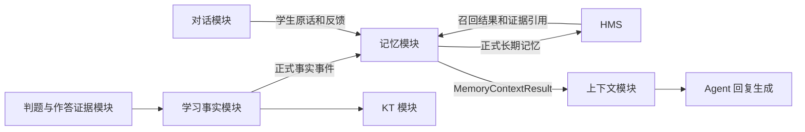
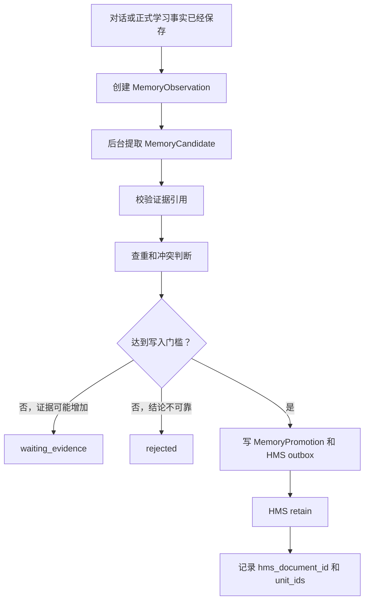
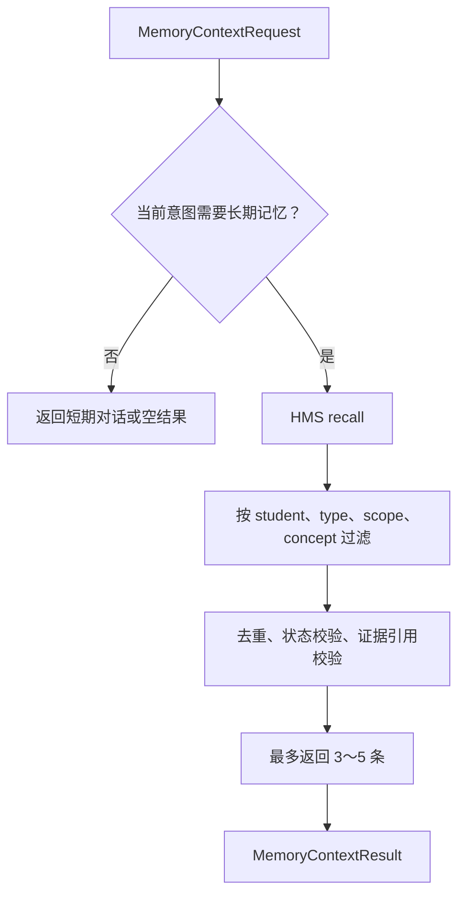

# MathTutor Agent 记忆模块开发设计（HMS 落地版）

> 状态：已确认，作为第一阶段实施依据。基于 HMS `a808ab393ca0227f0e515e9b4e768f8572c14f4f` 源码研究结果整理。
>
> 第一阶段只使用 HMS。旧 Graphiti 决策已由 `docs/adr/0004-hms-long-term-memory.md` 正式替代。
>
> 代码级模型、SQLite DDL、状态机和 Adapter 契约见 `记忆模块数据与接口详细设计.md`。

## 1. 一句话说明

```text
记忆模块负责把已经发生的对话和学习事实，整理成有证据的学生长期画像，
并在确实需要个性化教学时，返回少量相关记忆。
```

说得更直白一点：

```text
判题模块回答“这次答得对不对”。
KT 模块回答“学生整体掌握得怎么样”。
记忆模块回答“以后教这个学生时，有哪些稳定信息值得记住”。
```

记忆模块不能因为一次答错，就写下“学生总是犯这个错误”；也不能因为 AI 使用过一种讲法，就写下“这种讲法对学生有效”。

---

## 2. 已确定的技术决策

第一阶段采用：

```text
记忆底座：HMS。
数据库：PostgreSQL 16 + pgvector。
候选提取模型：云端 DeepSeek V4 Pro。
Embedding：云端 `BAAI/bge-m3`，使用 1024 维 dense vector。
后台处理：持久任务表 + 单 Worker。
Graphiti / Neo4j：第一阶段不接入，只保留以后扩展的接口。
```

选择第一阶段只用 HMS 的原因：

```text
HMS 已经具备向量检索、关键词检索、时间检索和关系扩展检索。
HMS 已经能保存 source memory、时间、标签、更新历史和删除关系。
同时运行 HMS 和 Graphiti 会出现两套关系数据、两套同步任务和两套故障处理。
现阶段还没有证据证明 MathTutor 必须增加 Neo4j 才能完成核心教学流程。
```

以后只有在以下需求被真实验证后，才增加 Graphiti：

```text
需要复杂的多跳关系查询。
HMS 内置关系扩展无法满足知识点、错因和策略之间的查询。
已经有明确测试集证明增加 Graphiti 能提升结果。
```

---

## 3. HMS 到底是什么

HMS 是 MathTutor 外接的长期记忆服务，不是 MathTutor 的判题、KT 或记忆业务规则本身。

```text
MathTutor 记忆模块 = 决定记什么、什么时候更新、什么时候删除。
HMS             = 把正式记忆存下来，并在以后需要时找出来。
PostgreSQL      = HMS 底层实际保存数据的数据库。
```

整体关系：

```text
学生对话和学习事实
        ↓
MathTutor 自己开发的记忆模块
        ↓ 证据审核通过
HMS 外部记忆服务
        ↓
PostgreSQL + pgvector
```

### 3.1 HMS 负责

```text
保存审核通过的正式长期记忆。
建立 embedding、关键词、时间和标签索引。
根据问题召回相关记忆。
按照稳定 document_id 替换已有记忆。
删除记忆正文、索引和底层关联数据。
提供后台任务、重试状态和基础关系扩展能力。
```

### 3.2 HMS 不负责

```text
不判断答案正确与否。
不判断一次答错是否属于重复错因。
不判断教学策略是否真的有效。
不计算学生掌握度。
不决定下一道题。
不决定哪些候选有资格成为正式记忆。
```

### 3.3 查重和清理分工

| 工作 | 负责方 |
|---|---|
| 判断两条记忆是不是同一业务结论 | MathTutor 记忆模块 |
| 生成稳定 `memory_key` | MathTutor 记忆模块 |
| 合并证据并判断是否达到门槛 | MathTutor 记忆模块 |
| 判断记忆是否冲突、过期或需要删除 | MathTutor 记忆模块 |
| 使用相同 `document_id` 防止重复存储 | MathTutor 提供标识，HMS 执行 |
| 替换正文和重建索引 | HMS |
| 删除正文、向量索引和底层关联 | HMS |
| HMS 失败后的 outbox 重试 | MathTutor 记忆模块 |

一句话总结：

```text
MathTutor 决定记什么、哪些重复、什么时候清理；
HMS 负责存进去、找出来、更新掉、删除掉。
```

---

## 4. 模块边界

### 4.1 记忆模块负责

```text
保存当前聊天窗口的短期对话。
接收已经保存的学生原话和学习事实引用。
生成 MemoryObservation（记忆原料）。
提取 MemoryCandidate（记忆候选）。
检查证据数量、来源、质量、重复和冲突。
决定候选是等待、拒绝还是晋升为正式长期记忆。
调用 HMS 保存、更新、删除和召回正式长期记忆。
保存记忆审核记录和 HMS 同步状态。
HMS 不可用时重试、熔断和降级。
向上下文模块返回少量记忆及证据引用。
```

### 4.2 记忆模块不负责

```text
不负责判题。
不保存另一套正式作答和判题事实。
不决定作答能否进入 KT。
不计算 mastery、答对概率或遗忘风险。
不检索教材、公式和题目解析。
不推荐下一题。
不生成最终教学回复。
不允许 LLM 修改 GradingResult 或 TeachingState。
```

### 4.3 权威关系

| 信息 | 权威模块 |
|---|---|
| 学生提交了什么 | 学习事实模块 |
| 本次答案是否正确 | 判题与作答证据模块 |
| 是否允许进入 KT | `EvidenceEligibility.eligible_for_kt` |
| 学生当前掌握状态 | KT / TeachingState |
| 哪些长期画像已经通过审核 | 记忆模块审核账本 |
| 正式长期记忆正文和召回索引 | HMS |

如果记忆内容与判题或 KT 冲突：

```text
判题和 KT 继续作为正式学习结论。
冲突记忆不得覆盖它们。
记忆模块把该记忆标记为 stale 或 disputed，等待重新审核。
```

---

## 5. 与其他模块如何联动



联动规则：

```text
判题模块不直接写 HMS。
KT 模块不直接写 HMS。
对话模块不直接使用 HMS 的自动 Retain 包装器。
上下文模块不能绕过 LearningMemorySystem 直接查询 HMS。
```

---

## 6. 记忆分层

### 6.1 Conversation Memory：短期对话

保存当前 `conversation_id` 最近 3～5 轮完整交互，用于理解：

```text
“这里为什么要通分？”
“继续讲刚才那一步。”
“我还是没懂。”
```

短期对话不等于长期画像，不自动进入 HMS。

### 6.2 Learning Facts：外部正式事实

包括：

```text
AnswerSubmission
GradingResult
AnswerEvidence
EvidenceEligibility
FormalLearningEvent
TeachingState 引用
```

这些数据归学习事实模块和 KT 模块所有。记忆模块只保存引用，不复制一套权威事实。

### 6.3 MemoryObservation：记忆原料

MemoryObservation 表示“这件事可能值得以后分析”，例如：

```text
学生明确说喜欢先看提示。
正式判题发现一次确定错因。
AI 使用了画图策略。
学生后续正式作答出现改善。
```

Observation 不是正式记忆，不能进入个性化回复。

### 6.4 MemoryCandidate：记忆候选

候选是 DeepSeek V4 Pro 或确定性规则整理出的结构化结论。

```text
candidate 只表示“可能成立”。
候选必须绑定原始证据。
候选必须通过代码门控后才能写入 HMS。
```

### 6.5 Long-term Memory：正式长期记忆

正式长期记忆是已经通过证据门控、允许跨聊天窗口使用的学生画像。

第一阶段只支持四类：

```text
preference：明确的学习偏好。
repeated_mistake：重复出现的确定错因。
effective_strategy：经过后续结果验证的有效教学策略。
reflection：学生明确表达的目标和自我反思。
```

---

## 7. 正式记忆的写入门槛

### 7.1 preference

允许写入：

```text
学生明确表达“我喜欢”“我希望”“不要直接告诉我答案”等偏好。
```

不允许直接写入：

```text
AI 根据一次行为推测学生偏好。
学生只是临时要求本题换一种讲法。
```

### 7.2 repeated_mistake

必须全部满足：

```text
至少两次独立正式作答。
来自不同 submission_id。
不是同一 question_state_version 的重复点击或网络重放。
属于相同 concept_id 和相同确定 mistake_code。
错因来自判题规则或可验证步骤证据，不来自 LLM 猜测。
```

一次答错只产生候选证据，不能形成 `repeated_mistake`。

### 7.3 effective_strategy

必须同时存在：

```text
strategy_exposure：系统确实使用过该教学策略。
outcome_evidence：学生明确表示有帮助，或者后续正式作答出现可归因改善。
```

AI 自己声称“这个方法有效”不算证据。

### 7.4 reflection

主要来自学生明确表达：

```text
“我想先把分数运算补起来。”
“我发现自己总忘记检查负号。”
```

系统生成的学习总结不能冒充学生自我反思。

---

## 8. 核心数据模型

### 8.1 MemoryObservation

```python
class MemoryObservation(BaseModel):
    observation_id: str
    student_id: str
    conversation_id: str | None
    event_id: str | None
    observation_type: str
    content: str
    source_refs: list[str]
    occurred_at: datetime | None
    created_at: datetime
```

### 8.2 MemoryCandidate

```python
class MemoryCandidate(BaseModel):
    candidate_id: str
    student_id: str
    memory_key: str
    memory_type: str
    scope: str
    summary: str
    evidence_refs: list[str]
    evidence_count: int
    confidence: float
    status: Literal["pending", "waiting_evidence", "approved", "rejected", "superseded"]
    rejection_reason: str | None
```

`memory_key` 用于查重和更新，例如：

```text
preference:global:hint_depth
mistake:fraction_addition:missing_common_denominator
strategy:linear_equation:draw_balance_model
reflection:goal:fraction_fundamentals
```

### 8.3 MemoryPromotion

本地不再复制一份完整长期记忆正文，只保存审核和 HMS 映射：

```python
class MemoryPromotion(BaseModel):
    promotion_id: str
    candidate_id: str
    memory_key: str
    decision: Literal["approved", "rejected", "superseded", "deleted"]
    decision_rule_version: str
    hms_bank_id: str | None
    hms_document_id: str | None
    hms_unit_ids: list[str]
    sync_status: Literal["pending", "succeeded", "failed", "deleted"]
    decided_at: datetime
```

这张表是审核账本，不是第二套记忆检索库。

---

## 9. 写入流程



关键规则：

```text
记忆提炼必须异步执行，不阻断判题、事实保存、KT 或回复。
先提交本地审核结果和 outbox，再调用 HMS。
HMS 调用失败时保留 pending 状态，由 Worker 重试。
相同 memory_key 的更新使用稳定 document_id 和 update_mode=replace。
```

---

## 10. HMS 接入设计

### 10.1 身份映射

```text
HMS bank_id = student:{不可逆稳定学生标识}
HMS document_id = memory:{memory_key 的稳定哈希}
```

不要把学生姓名、手机号等直接放进 `bank_id`。

### 10.2 HMS 写入内容

第一阶段写入 HMS 的是已经审核后的正式记忆，不是整段聊天记录。

示例：

```text
记忆类型：repeated_mistake
适用范围：concept:fraction_addition
正式结论：学生在分数加法中重复遗漏通分步骤。
证据数量：2
证据引用：submission_101, submission_148
审核规则版本：memory-gate-v1
```

HMS 参数映射：

| MathTutor 字段 | HMS 字段 |
|---|---|
| 正式记忆正文 | `content` |
| 记忆发生时间 | `timestamp` |
| 适用知识点和类型 | `tags` |
| `candidate_id`、规则版本、证据数量 | `metadata` |
| 稳定记忆标识 | `document_id` |
| 更新已有记忆 | `update_mode=replace` |

推荐标签：

```text
memory_type:repeated_mistake
scope:concept
concept:fraction_addition
status:active
schema:v1
```

### 10.3 第一阶段 HMS 配置

第一阶段推荐：

```text
retain_extraction_mode=chunks
enable_observations=false
reranker_provider=rrf
```

原因：

```text
正式记忆已经由 MathTutor 审核，不需要 HMS 再用 LLM 改写一次。
chunks 模式会原样保存正文，不调用 HMS 的事实抽取 LLM。
关闭 observations 可以避免 HMS 再自动生成未经 MathTutor 门控的新结论。
HMS 仍可使用 embedding、BM25、时间和内置链接进行召回。
```

DeepSeek V4 Pro 主要用于 MathTutor 的候选提取，不负责决定候选能否晋升。

### 10.4 Embedding 正式选型

正式模型确定为：

```text
模型：BAAI/bge-m3
运行方式：云端 Embedding 接口
HMS Provider：openai-compatible
向量类型：dense vector
向量维度：1024
```

不使用 HMS 默认的 `BAAI/bge-small-en-v1.5`，因为它偏英文。选择 `BAAI/bge-m3` 的原因：

```text
支持中文和数学表达。
支持中英文混合内容。
社区使用广泛，云端服务选择较多。
能够覆盖短记忆、知识点名称和较长学习描述。
维度固定为 1024，HMS 可以在初始化时自动探测。
```

接入配置示例：

```env
HMS_API_EMBEDDINGS_PROVIDER=openai
HMS_API_EMBEDDINGS_OPENAI_MODEL=BAAI/bge-m3
HMS_API_EMBEDDINGS_OPENAI_BASE_URL=<embedding-provider-base-url>
HMS_API_EMBEDDINGS_OPENAI_API_KEY=<embedding-provider-api-key>
```

正式上线前仍需使用 MathTutor 自建数据集验证：

```text
中文错因查询召回率。
同义表达召回率。
无关记忆误召回率。
单次请求延迟和费用。
```

模型切换约束：

```text
同一个 HMS 数据库和向量索引只能使用一致的 embedding 模型和维度。
不得在运行中静默切换到 M3E 或其他维度模型。
以后更换模型时，必须重新生成全部记忆向量并重建索引。
Embedding 服务失败时返回失败或进入重试，不能使用另一模型临时生成不兼容向量。
```

---

## 11. 读取流程



读取策略：

| 场景 | 是否查询长期记忆 |
|---|---:|
| 正式提交答案 | 否 |
| 查看答案 | 否 |
| 普通闲聊 | 否 |
| 普通数学概念查询 | 通常否，优先 RAG |
| 当前题求助 | 按需 |
| 解释重复错因 | 是 |
| 调整提示方式 | 是 |
| 学习复盘 | 是 |

每次返回：

```text
最多 3～5 条。
同一 memory_type 最多 2 条。
只返回 active 且证据仍然存在的记忆。
不得把 HMS 的相似度分数解释成事实可信度。
```

---

## 12. 对外接口

主流程只依赖一个深模块：

```python
class LearningMemorySystem:
    async def observe(
        self,
        observation: MemoryObservation,
    ) -> ObservationReceipt:
        """保存原料并创建后台提炼任务，不直接写正式记忆。"""

    async def context_for(
        self,
        request: MemoryContextRequest,
    ) -> MemoryContextResult:
        """按意图返回少量正式记忆和证据引用。"""

    async def disable(self, memory_key: str, reason: str) -> None:
        """立即停止某条记忆参与召回。"""

    async def delete(self, memory_key: str) -> None:
        """删除 HMS document，并保留最小删除审计记录。"""
```

HMS 被封装在内部 Adapter：

```python
class LongTermMemoryAdapter(Protocol):
    async def retain(self, request: RetainApprovedMemory) -> RetainResult: ...
    async def recall(self, request: RecallApprovedMemory) -> RecallResult: ...
    async def delete(self, bank_id: str, document_id: str) -> None: ...


class HMSLongTermMemoryAdapter(LongTermMemoryAdapter):
    ...
```

业务代码不得直接依赖 HMS SDK 或 HTTP 返回结构。

---

## 13. 故障与容错

### 13.1 HMS 写入失败

```text
本地审核结果和 outbox 已经提交。
sync_status=failed 或 pending。
Worker 使用幂等 document_id 重试。
不阻断判题、KT、当前回复和学习事实保存。
未成功写入 HMS 的候选不得参与召回。
```

### 13.2 HMS 查询失败

```text
设置较短超时。
连续失败后打开熔断器。
返回 degraded=true，不伪造记忆。
当前对话、学习事实、KT 和 RAG 继续工作。
```

第一阶段可以增加只读的“最近成功召回缓存”：

```text
缓存只保存已经审核且曾由 HMS 成功返回的结果。
缓存按 student_id + intent + concept_id 隔离。
TTL 建议不超过 6 小时。
disable、delete 和删除学生时必须立即清除缓存。
缓存结果必须标记 source=cache、degraded=true。
```

### 13.3 DeepSeek V4 Pro 失败

```text
候选提取任务重试。
解析失败或结构不完整时不生成正式记忆。
已经存在的 HMS 记忆仍然可以正常召回。
```

### 13.4 Embedding 服务失败

```text
HMS retain 或 recall 进入失败处理。
不切换到未经验证的另一个 embedding 模型。
恢复后继续处理 pending outbox。
更换 embedding 模型必须执行全量重建或迁移验证。
```

---

## 14. 更新、冲突和删除

### 更新

相同 `memory_key` 出现新证据时：

```text
重新计算证据数量和状态。
写入新的 MemoryPromotion 审核记录。
使用相同 HMS document_id 和 update_mode=replace。
旧审核记录保留，不原地覆盖历史决定。
```

### 冲突

例如学生以前说喜欢详细讲解，后来明确说只要简短提示：

```text
新明确表达优先。
旧候选标记 superseded。
正式记忆替换为当前偏好。
保留旧证据和变更历史，但旧状态不参与召回。
```

### 删除

```text
先在本地审核账本标记 deleted，并立即清除召回缓存。
通过 outbox 调用 HMS delete_document。
删除失败时后台重试。
删除中的记忆不得继续参与上下文。
```

删除整个学生时必须删除：

```text
短期对话。
MemoryObservation 和 MemoryCandidate。
MemoryPromotion 和同步任务。
HMS student bank。
该学生的召回缓存。
```

---

## 15. 后台任务

第一阶段至少需要：

```text
memory_candidate_extract：提取候选。
memory_candidate_evaluate：执行证据门控和冲突判断。
hms_retain：写入或替换正式记忆。
hms_delete：删除正式记忆。
memory_reconcile：核对本地审核账本与 HMS 状态。
```

任务共同字段：

```text
job_id
job_type
idempotency_key
student_id
payload
status
retry_count
next_retry_at
last_error_code
created_at
updated_at
```

不要只使用进程内队列，否则服务重启会丢失待写记忆。

---

## 16. 开发阶段

### Phase 1：清理模块边界

```text
实现 LearningMemorySystem 接口。
补充 conversation_id、turn_id 和完整短期对话记录。
停止一次答错直接写 repeated_mistake。
停止一次答对直接写 effective_strategy。
禁止判题、KT 和 Agent 直接调用记忆 Provider。
```

### Phase 2：候选和证据门控

```text
实现 MemoryObservation、MemoryCandidate、MemoryPromotion。
实现四类记忆的确定性门槛。
接入 DeepSeek V4 Pro，只输出结构化候选。
实现 memory_key 查重、冲突和 supersede。
```

### Phase 3：HMS 最小接入

```text
部署 PostgreSQL + pgvector + HMS API + HMS Worker。
实现 HMSLongTermMemoryAdapter。
一个 student 对应一个 HMS bank。
使用 chunks 模式和关闭 observations。
实现 retain、recall、replace、delete 和学生删除。
```

### Phase 4：容错和质量验证

```text
实现 outbox 重试、熔断、健康检查和最近成功召回缓存。
建立中文数学记忆召回测试集。
验证 BGE-M3 的召回率、误召回率、延迟和费用。
记录错误记忆率、漏记率和无关召回率。
```

### Phase 5：决定是否需要 Graphiti

只有 HMS 无法满足真实关系查询，且测试证明关系图有收益时再启动。

---

## 17. 验收标准

```text
[ ] 一次答错不会生成 repeated_mistake。
[ ] 一次答对不会生成 effective_strategy。
[ ] 聊天中的猜测答案不会成为正式作答事实。
[ ] 每条正式记忆都能追溯到已有 source_refs。
[ ] 相同 memory_key 重试不会生成重复 HMS document。
[ ] 更新记忆会替换当前版本并保留本地审核历史。
[ ] 删除后记忆立即退出缓存和召回。
[ ] HMS 写入失败不阻断判题、学习事实和 KT。
[ ] HMS 查询失败时明确返回 degraded，不伪造结果。
[ ] Memory 内容不能覆盖 GradingResult 或 TeachingState。
[ ] 普通提交、查看答案和普通闲聊不查询长期记忆。
[ ] 每轮最多返回 3～5 条相关记忆。
[ ] 正式环境固定使用云端 `BAAI/bge-m3` 和 1024 维向量。
[ ] Embedding 模型或维度变化时会拒绝启动或要求重建索引。
[ ] Graphiti 没有成为第一阶段必须依赖。
```

---

## 18. 最终结论

第一阶段的记忆系统不是“让 HMS 自动记住所有聊天”。

正确链路是：

```text
学习事实和学生原话先保存
→ MathTutor 生成候选
→ 代码检查证据和门槛
→ 通过后显式写入 HMS
→ 需要个性化教学时按意图召回
```

模块分工最终确定为：

```text
MathTutor 决定什么有资格成为长期记忆。
HMS 负责正式记忆的存储、索引、更新、删除和召回。
DeepSeek V4 Pro 负责理解自然语言并生成候选，不负责最终批准。
Graphiti 暂不接入，等关系查询需求被真实验证后再决定。
```
